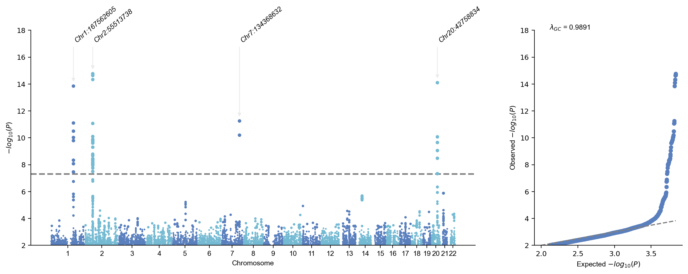
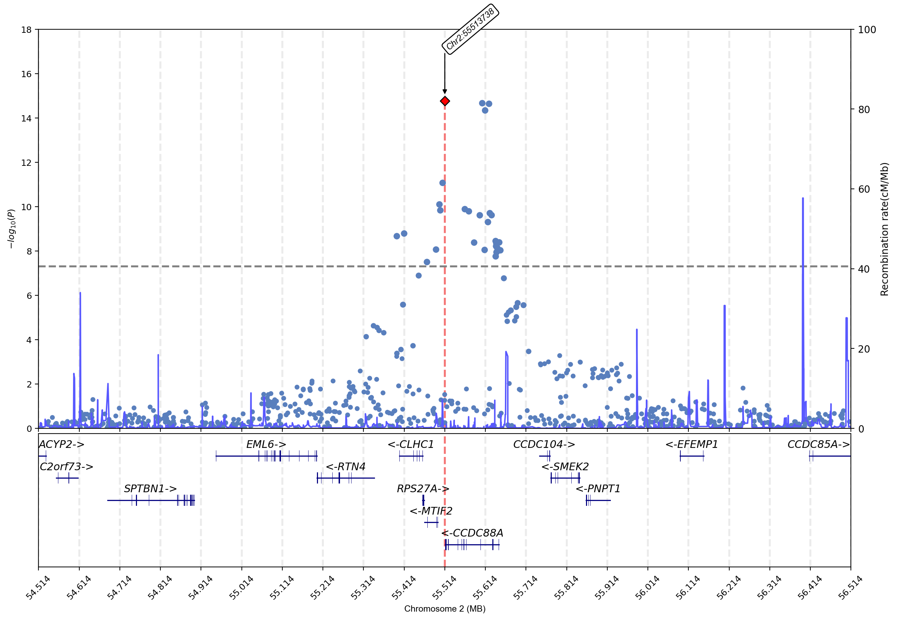
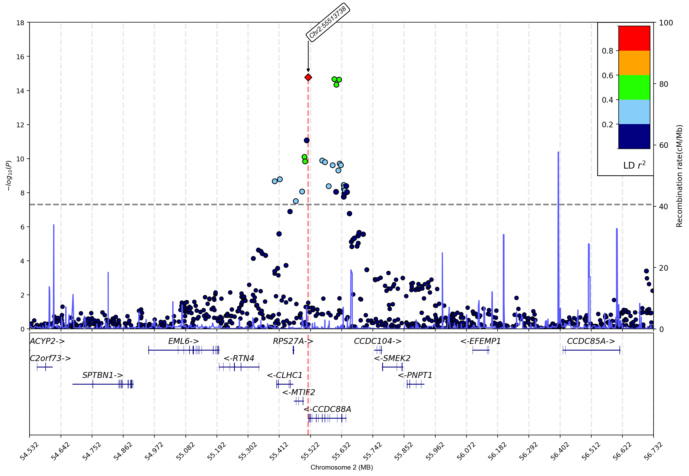

# Visualization by gwaslab

## Import gwaslab package


```python
import gwaslab as gl

```

## Load sumstats


```python
sumstats = gl.Sumstats("1kgeas.B1.glm.firth",fmt="plink2")

```

**stdout:**

```
Tue Dec 26 15:56:49 2023 GWASLab v3.4.22 https://cloufield.github.io/gwaslab/
Tue Dec 26 15:56:49 2023 (C) 2022-2023, Yunye He, Kamatani Lab, MIT License, gwaslab@gmail.com
Tue Dec 26 15:56:49 2023 Start to load format from formatbook....
Tue Dec 26 15:56:49 2023  -plink2 format meta info:
Tue Dec 26 15:56:49 2023   - format_name  : PLINK2 .glm.firth, .glm.logistic,.glm.linear
Tue Dec 26 15:56:49 2023   - format_source  : https://www.cog-genomics.org/plink/2.0/formats
Tue Dec 26 15:56:49 2023   - format_version  : Alpha 3.3 final (3 Jun)
Tue Dec 26 15:56:49 2023   - last_check_date  :  20220806
Tue Dec 26 15:56:49 2023  -plink2 to gwaslab format dictionary:
Tue Dec 26 15:56:49 2023   - plink2 keys: ID,#CHROM,POS,REF,ALT,A1,OBS_CT,A1_FREQ,BETA,LOG(OR)_SE,SE,T_STAT,Z_STAT,P,LOG10_P,MACH_R2,OR
Tue Dec 26 15:56:49 2023   - gwaslab values: SNPID,CHR,POS,REF,ALT,EA,N,EAF,BETA,SE,SE,T,Z,P,MLOG10P,INFO,OR
Tue Dec 26 15:56:49 2023 Start to initiate from file :1kgeas.B1.glm.firth
Tue Dec 26 15:56:50 2023  -Reading columns          : REF,ID,ALT,POS,OR,LOG(OR)_SE,Z_STAT,OBS_CT,A1,#CHROM,P,A1_FREQ
Tue Dec 26 15:56:50 2023  -Renaming columns to      : REF,SNPID,ALT,POS,OR,SE,Z,N,EA,CHR,P,EAF
Tue Dec 26 15:56:50 2023  -Current Dataframe shape : 1128732  x  12
Tue Dec 26 15:56:50 2023  -Initiating a status column: STATUS ...
Tue Dec 26 15:56:50 2023  NEA not available: assigning REF to NEA...
Tue Dec 26 15:56:50 2023  -EA,REF and ALT columns are available: assigning NEA...
Tue Dec 26 15:56:50 2023  -For variants with EA == ALT : assigning REF to NEA ...
Tue Dec 26 15:56:50 2023  -For variants with EA != ALT : assigning ALT to NEA ...
Tue Dec 26 15:56:50 2023 Start to reorder the columns...
Tue Dec 26 15:56:50 2023  -Current Dataframe shape : 1128732  x  14
Tue Dec 26 15:56:50 2023  -Reordering columns to    : SNPID,CHR,POS,EA,NEA,EAF,SE,Z,P,OR,N,STATUS,REF,ALT
Tue Dec 26 15:56:50 2023 Finished sorting columns successfully!
Tue Dec 26 15:56:50 2023  -Column: SNPID  CHR   POS   EA       NEA      EAF     SE      Z       P       OR      N     STATUS   REF      ALT
Tue Dec 26 15:56:50 2023  -DType : object int64 int64 category category float64 float64 float64 float64 float64 int64 category category category
Tue Dec 26 15:56:50 2023 Finished loading data successfully!

```


```python
sumstats.data

```

| SNPID | CHR | POS | EA | NEA | EAF | SE | Z | P | OR | N | STATUS | REF | ALT |
| --- | --- | --- | --- | --- | --- | --- | --- | --- | --- | --- | --- | --- | --- |
| 1:15774:G:A | 1 | 15774 | A | G | 0.028283 | NaN | NaN | NaN | NaN | 495 | 9999999 | G | A |
| 1:15777:A:G | 1 | 15777 | G | A | 0.073737 | NaN | NaN | NaN | NaN | 495 | 9999999 | A | G |
| 1:57292:C:T | 1 | 57292 | T | C | 0.104675 | NaN | NaN | NaN | NaN | 492 | 9999999 | C | T |
| 1:77874:G:A | 1 | 77874 | A | G | 0.019153 | 0.462750 | 0.249299 | 0.803130 | 1.122280 | 496 | 9999999 | G | A |
| 1:87360:C:T | 1 | 87360 | T | C | 0.023139 | NaN | NaN | NaN | NaN | 497 | 9999999 | C | T |
| ... | ... | ... | ... | ... | ... | ... | ... | ... | ... | ... | ... | ... | ... |
| 22:51217954:G:A | 22 | 51217954 | A | G | 0.033199 | NaN | NaN | NaN | NaN | 497 | 9999999 | G | A |
| 22:51218377:G:C | 22 | 51218377 | C | G | 0.033333 | 0.362212 | -0.994457 | 0.320000 | 0.697534 | 495 | 9999999 | G | C |
| 22:51218615:T:A | 22 | 51218615 | A | T | 0.033266 | 0.362476 | -1.029230 | 0.303374 | 0.688618 | 496 | 9999999 | T | A |
| 22:51222100:G:T | 22 | 51222100 | T | G | 0.039157 | NaN | NaN | NaN | NaN | 498 | 9999999 | G | T |
| 22:51239678:G:T | 22 | 51239678 | T | G | 0.034137 | NaN | NaN | NaN | NaN | 498 | 9999999 | G | T |

## Check the lead variants in significant loci


```python
sumstats.get_lead(sig_level=5e-8)

```

**stdout:**

```
Tue Dec 26 15:56:51 2023 Start to extract lead variants...
Tue Dec 26 15:56:51 2023  -Processing 1128732 variants...
Tue Dec 26 15:56:51 2023  -Significance threshold : 5e-08
Tue Dec 26 15:56:51 2023  -Sliding window size: 500  kb
Tue Dec 26 15:56:51 2023  -Found 43 significant variants in total...
Tue Dec 26 15:56:51 2023  -Identified 4 lead variants!
Tue Dec 26 15:56:51 2023 Finished extracting lead variants successfully!

```

| SNPID | CHR | POS | EA | NEA | EAF | SE | Z | P | OR | N | STATUS | REF | ALT |
| --- | --- | --- | --- | --- | --- | --- | --- | --- | --- | --- | --- | --- | --- |
| 1:167562605:G:A | 1 | 167562605 | A | G | 0.391481 | 0.159645 | 7.69462 | 1.419150e-14 | 3.415780 | 493 | 9999999 | G | A |
| 2:55513738:C:T | 2 | 55513738 | C | T | 0.376008 | 0.153159 | -7.96244 | 1.686760e-15 | 0.295373 | 496 | 9999999 | C | T |
| 7:134368632:T:G | 7 | 134368632 | G | T | 0.138105 | 0.225526 | 6.89025 | 5.569440e-12 | 4.730010 | 496 | 9999999 | T | G |
| 20:42758834:T:C | 20 | 42758834 | T | C | 0.227273 | 0.184323 | -7.76902 | 7.909780e-15 | 0.238829 | 495 | 9999999 | T | C |

## Create mahattan plot


```python
sumstats.plot_mqq(skip=2,anno=True)

```

**stdout:**

```
Tue Dec 26 15:59:17 2023 Start to plot manhattan/qq plot with the following basic settings:
Tue Dec 26 15:59:17 2023  -Genomic coordinates version: 99...
Tue Dec 26 15:59:17 2023    -WARNING!!! Genomic coordinates version is unknown...
Tue Dec 26 15:59:17 2023  -Genome-wide significance level is set to 5e-08 ...
Tue Dec 26 15:59:17 2023  -Raw input contains 1128732 variants...
Tue Dec 26 15:59:17 2023  -Plot layout mode is : mqq
Tue Dec 26 15:59:17 2023 Finished loading specified columns from the sumstats.
Tue Dec 26 15:59:17 2023 Start conversion and sanity check:
Tue Dec 26 15:59:17 2023  -Removed 0 variants with nan in CHR or POS column ...
Tue Dec 26 15:59:17 2023  -Removed 0 varaints with CHR <=0...
Tue Dec 26 15:59:17 2023  -Removed 220793 variants with nan in P column ...
Tue Dec 26 15:59:17 2023  -Sanity check after conversion: 0 variants with P value outside of (0,1] will be removed...
Tue Dec 26 15:59:17 2023  -Sumstats P values are being converted to -log10(P)...
Tue Dec 26 15:59:17 2023  -Sanity check: 0 na/inf/-inf variants will be removed...
Tue Dec 26 15:59:17 2023  -Maximum -log10(P) values is 14.772946706439042 .
Tue Dec 26 15:59:17 2023 Finished data conversion and sanity check.
Tue Dec 26 15:59:17 2023 Start to create manhattan plot with 6866 variants:
Tue Dec 26 15:59:17 2023  -Found 4 significant variants with a sliding window size of 500 kb...
Tue Dec 26 15:59:17 2023 Finished creating Manhattan plot successfully!
Tue Dec 26 15:59:17 2023  -Annotating using column CHR:POS...
Tue Dec 26 15:59:17 2023  -Adjusting text positions with repel_force=0.03...
Tue Dec 26 15:59:17 2023 Start to create QQ plot with 6866 variants:
Tue Dec 26 15:59:17 2023 Expected range of P: (0,1.0)
Tue Dec 26 15:59:17 2023  -Lambda GC (MLOG10P mode) at 0.5 is   0.98908
Tue Dec 26 15:59:17 2023 Finished creating QQ plot successfully!
Tue Dec 26 15:59:17 2023  -Skip saving figures!

```


```
(<Figure size 3000x1000 with 2 Axes>, <gwaslab.Log.Log at 0x7f55daa2f400>)

```



## QC check


```python
sumstats.basic_check()

```

**stdout:**

```
Tue Dec 27 23:08:13 2022 Start to check IDs...
Tue Dec 27 23:08:13 2022  -Current Dataframe shape : 1122299  x  11
Tue Dec 27 23:08:13 2022  -Checking if SNPID is chr:pos:ref:alt...(separator: - ,: , _)
Tue Dec 27 23:08:14 2022 Finished checking IDs successfully!
Tue Dec 27 23:08:14 2022 Start to fix chromosome notation...
Tue Dec 27 23:08:14 2022  -Current Dataframe shape : 1122299  x  11
Tue Dec 27 23:08:17 2022  -Vairants with standardized chromosome notation: 1122299
Tue Dec 27 23:08:19 2022  -All CHR are already fixed...
Tue Dec 27 23:08:21 2022 Finished fixing chromosome notation successfully!
Tue Dec 27 23:08:21 2022 Start to fix basepair positions...
Tue Dec 27 23:08:21 2022  -Current Dataframe shape : 1122299  x  11
Tue Dec 27 23:08:21 2022  -Converting to Int64 data type ...
Tue Dec 27 23:08:22 2022  -Position upper_bound is: 250,000,000
Tue Dec 27 23:08:24 2022  -Remove outliers: 0
Tue Dec 27 23:08:24 2022  -Converted all position to datatype Int64.
Tue Dec 27 23:08:24 2022 Finished fixing basepair position successfully!
Tue Dec 27 23:08:24 2022 Start to fix alleles...
Tue Dec 27 23:08:24 2022  -Current Dataframe shape : 1122299  x  11
Tue Dec 27 23:08:25 2022  -Detected 0 variants with alleles that contain bases other than A/C/T/G .
Tue Dec 27 23:08:25 2022  -Converted all bases to string datatype and UPPERCASE.
Tue Dec 27 23:08:27 2022 Finished fixing allele successfully!
Tue Dec 27 23:08:27 2022 Start sanity check for statistics ...
Tue Dec 27 23:08:27 2022  -Current Dataframe shape : 1122299  x  11
Tue Dec 27 23:08:27 2022  -Checking if  0 <=N<= inf  ...
Tue Dec 27 23:08:27 2022  -Removed 0 variants with bad N.
Tue Dec 27 23:08:27 2022  -Checking if  -37.5 <Z< 37.5  ...
Tue Dec 27 23:08:27 2022  -Removed 14 variants with bad Z.
Tue Dec 27 23:08:27 2022  -Checking if  5e-300 <= P <= 1  ...
Tue Dec 27 23:08:27 2022  -Removed 0 variants with bad P.
Tue Dec 27 23:08:27 2022  -Checking if  0 <SE< inf  ...
Tue Dec 27 23:08:27 2022  -Removed 0 variants with bad SE.
Tue Dec 27 23:08:27 2022  -Checking if  -10 <log(OR)< 10  ...
Tue Dec 27 23:08:27 2022  -Removed 0 variants with bad OR.
Tue Dec 27 23:08:27 2022  -Checking STATUS...
Tue Dec 27 23:08:28 2022  -Coverting STAUTUS to interger.
Tue Dec 27 23:08:28 2022  -Removed 14 variants with bad statistics in total.
Tue Dec 27 23:08:28 2022 Finished sanity check successfully!
Tue Dec 27 23:08:28 2022 Start to normalize variants...
Tue Dec 27 23:08:28 2022  -Current Dataframe shape : 1122285  x  11
Tue Dec 27 23:08:29 2022  -No available variants to normalize..
Tue Dec 27 23:08:29 2022 Finished normalizing variants successfully!

```

## Create regional plot


```python
sumstats.plot_mqq(mode="r",anno=True,region=(2,54513738,56513738),region_grid=True,build="19")
#2:55513738

```

**stdout:**

```
Tue Dec 26 15:58:10 2023 Start to plot manhattan/qq plot with the following basic settings:
Tue Dec 26 15:58:10 2023  -Genomic coordinates version: 19...
Tue Dec 26 15:58:10 2023  -Genome-wide significance level is set to 5e-08 ...
Tue Dec 26 15:58:10 2023  -Raw input contains 1128732 variants...
Tue Dec 26 15:58:10 2023  -Plot layout mode is : r
Tue Dec 26 15:58:10 2023  -Region to plot : chr2:54513738-56513738.
Tue Dec 26 15:58:10 2023  -Extract SNPs in region : chr2:54513738-56513738...
Tue Dec 26 15:58:10 2023  -Extract SNPs in specified regions: 865
Tue Dec 26 15:58:10 2023 Finished loading specified columns from the sumstats.
Tue Dec 26 15:58:10 2023 Start conversion and sanity check:
Tue Dec 26 15:58:10 2023  -Removed 0 variants with nan in CHR or POS column ...
Tue Dec 26 15:58:10 2023  -Removed 0 varaints with CHR <=0...
Tue Dec 26 15:58:10 2023  -Removed 160 variants with nan in P column ...
Tue Dec 26 15:58:10 2023  -Sanity check after conversion: 0 variants with P value outside of (0,1] will be removed...
Tue Dec 26 15:58:10 2023  -Sumstats P values are being converted to -log10(P)...
Tue Dec 26 15:58:10 2023  -Sanity check: 0 na/inf/-inf variants will be removed...
Tue Dec 26 15:58:11 2023  -Maximum -log10(P) values is 14.772946706439042 .
Tue Dec 26 15:58:11 2023 Finished data conversion and sanity check.
Tue Dec 26 15:58:11 2023 Start to create manhattan plot with 705 variants:
Tue Dec 26 15:58:11 2023  -Extracting lead variant...
Tue Dec 26 15:58:11 2023  -Loading gtf files from:default

```

**stderr:**

```
INFO:root:Extracted GTF attributes: ['gene_id', 'gene_name', 'gene_biotype']

```

**stdout:**

```
Tue Dec 26 15:58:40 2023  -plotting gene track..
Tue Dec 26 15:58:40 2023  -Finished plotting gene track..
Tue Dec 26 15:58:40 2023  -Found 1 significant variants with a sliding window size of 500 kb...
Tue Dec 26 15:58:40 2023 Finished creating Manhattan plot successfully!
Tue Dec 26 15:58:40 2023  -Annotating using column CHR:POS...
Tue Dec 26 15:58:40 2023  -Adjusting text positions with repel_force=0.03...
Tue Dec 26 15:58:40 2023  -Skip saving figures!

```


```
(<Figure size 3000x2000 with 3 Axes>, <gwaslab.Log.Log at 0x7f55daa2f400>)

```



## Create regional plot with LD information


```python
gl.download_ref("1kg_eas_hg19")

```

**stdout:**

```
Tue Dec 27 22:44:52 2022 Start to download  1kg_eas_hg19  ...
Tue Dec 27 22:44:52 2022  -Downloading to: /home/he/anaconda3/envs/py38/lib/python3.8/site-packages/gwaslab/data/EAS.ALL.split_norm_af.1kgp3v5.hg19.vcf.gz
Tue Dec 27 22:52:33 2022  -Updating record in config file...
Tue Dec 27 22:52:35 2022  -Updating record in config file...
Tue Dec 27 22:52:35 2022  -Downloading to: /home/he/anaconda3/envs/py38/lib/python3.8/site-packages/gwaslab/data/EAS.ALL.split_norm_af.1kgp3v5.hg19.vcf.gz.tbi
Tue Dec 27 22:52:35 2022 Downloaded  1kg_eas_hg19  successfully!

```


```python
sumstats.plot_mqq(mode="r",anno=True,region=(2,54531536,56731536),region_grid=True,vcf_path=gl.get_path("1kg_eas_hg19"),build="19")

```

**stdout:**

```
Tue Dec 26 15:58:41 2023 Start to plot manhattan/qq plot with the following basic settings:
Tue Dec 26 15:58:41 2023  -Genomic coordinates version: 19...
Tue Dec 26 15:58:41 2023  -Genome-wide significance level is set to 5e-08 ...
Tue Dec 26 15:58:41 2023  -Raw input contains 1128732 variants...
Tue Dec 26 15:58:41 2023  -Plot layout mode is : r
Tue Dec 26 15:58:41 2023  -Region to plot : chr2:54531536-56731536.
Tue Dec 26 15:58:41 2023  -Checking prefix for chromosomes in vcf files...
Tue Dec 26 15:58:41 2023  -No prefix for chromosomes in the VCF files.
Tue Dec 26 15:58:41 2023  -Extract SNPs in region : chr2:54531536-56731536...
Tue Dec 26 15:58:41 2023  -Extract SNPs in specified regions: 967
Tue Dec 26 15:58:41 2023 Finished loading specified columns from the sumstats.
Tue Dec 26 15:58:41 2023 Start conversion and sanity check:
Tue Dec 26 15:58:41 2023  -Removed 0 variants with nan in CHR or POS column ...
Tue Dec 26 15:58:41 2023  -Removed 0 varaints with CHR <=0...
Tue Dec 26 15:58:41 2023  -Removed 172 variants with nan in P column ...
Tue Dec 26 15:58:41 2023  -Sanity check after conversion: 0 variants with P value outside of (0,1] will be removed...
Tue Dec 26 15:58:41 2023  -Sumstats P values are being converted to -log10(P)...
Tue Dec 26 15:58:41 2023  -Sanity check: 0 na/inf/-inf variants will be removed...
Tue Dec 26 15:58:41 2023  -Maximum -log10(P) values is 14.772946706439042 .
Tue Dec 26 15:58:41 2023 Finished data conversion and sanity check.
Tue Dec 26 15:58:41 2023 Start to load reference genotype...
Tue Dec 26 15:58:41 2023  -reference vcf path : /home/yunye/.gwaslab/EAS.ALL.split_norm_af.1kgp3v5.hg19.vcf.gz
Tue Dec 26 15:58:43 2023  -Retrieving index...
Tue Dec 26 15:58:43 2023  -Ref variants in the region: 71908
Tue Dec 26 15:58:43 2023  -Matching variants using POS, NEA, EA ...
Tue Dec 26 15:58:43 2023  -Calculating Rsq...
Tue Dec 26 15:58:43 2023 Finished loading reference genotype successfully!
Tue Dec 26 15:58:43 2023 Start to create manhattan plot with 795 variants:
Tue Dec 26 15:58:43 2023  -Extracting lead variant...
Tue Dec 26 15:58:44 2023  -Loading gtf files from:default

```

**stderr:**

```
INFO:root:Extracted GTF attributes: ['gene_id', 'gene_name', 'gene_biotype']

```

**stdout:**

```
Tue Dec 26 15:59:12 2023  -plotting gene track..
Tue Dec 26 15:59:12 2023  -Finished plotting gene track..
Tue Dec 26 15:59:13 2023  -Found 1 significant variants with a sliding window size of 500 kb...
Tue Dec 26 15:59:13 2023 Finished creating Manhattan plot successfully!
Tue Dec 26 15:59:13 2023  -Annotating using column CHR:POS...
Tue Dec 26 15:59:13 2023  -Adjusting text positions with repel_force=0.03...
Tue Dec 26 15:59:13 2023  -Skip saving figures!

```


```
(<Figure size 3000x2000 with 4 Axes>, <gwaslab.Log.Log at 0x7f55daa2f400>)

```


