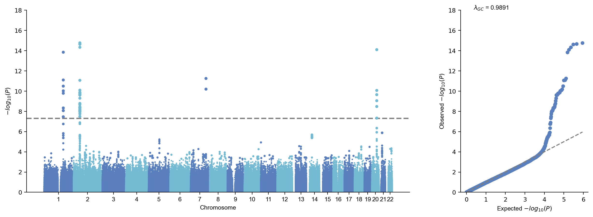
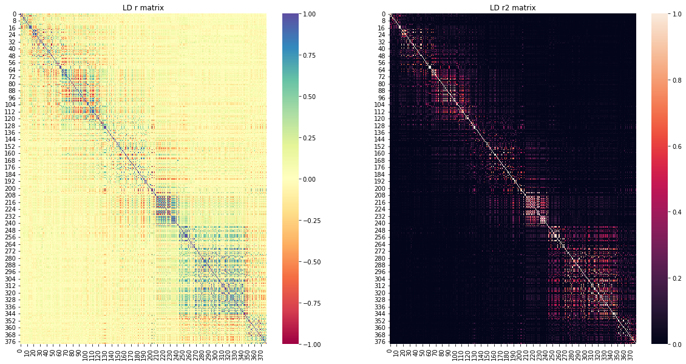
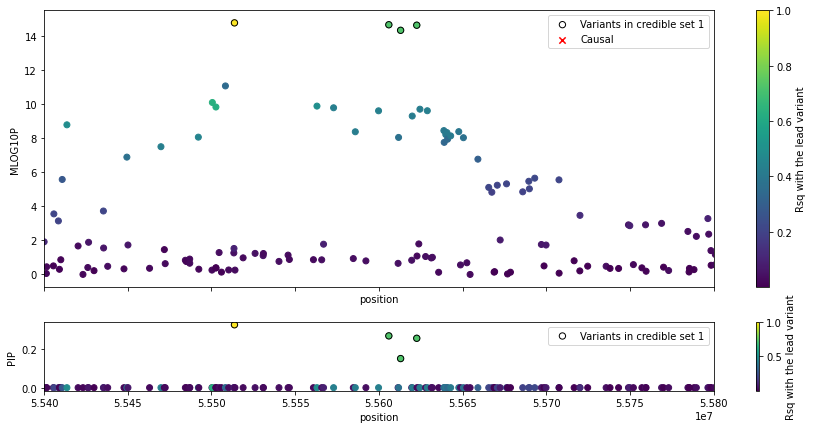
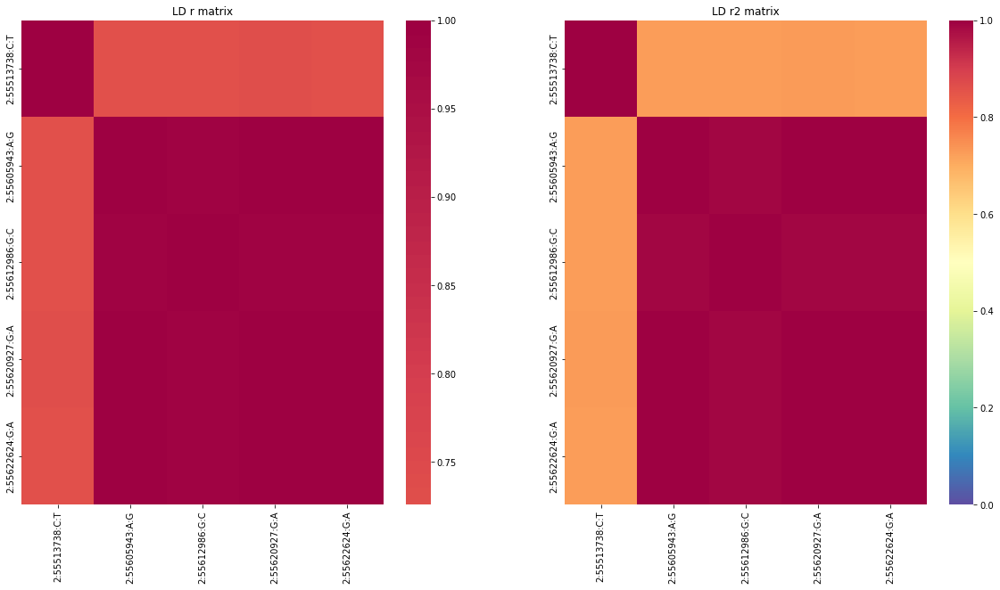

# Finemapping using susieR

## Data preparation


```python
import sys
sys.path.insert(0,"/home/yunye/work/gwaslab/src")
import gwaslab as gl
import pandas as pd
import numpy as np
import seaborn as sns
import matplotlib.pyplot as plt
import gc

```

### Load sumstats


```python
sumstats = gl.Sumstats("./1kgeas.B1.glm.firth.gz",fmt="plink2")

```

**stdout:**

```
2024/04/19 22:44:31 GWASLab v3.4.43 https://cloufield.github.io/gwaslab/
2024/04/19 22:44:31 (C) 2022-2024, Yunye He, Kamatani Lab, MIT License, gwaslab@gmail.com
2024/04/19 22:44:31 Start to load format from formatbook....
2024/04/19 22:44:31  -plink2 format meta info:
2024/04/19 22:44:31   - format_name  : PLINK2 .glm.firth, .glm.logistic,.glm.linear
2024/04/19 22:44:31   - format_source  : https://www.cog-genomics.org/plink/2.0/formats
2024/04/19 22:44:31   - format_version  : Alpha 3.3 final (3 Jun)
2024/04/19 22:44:31   - last_check_date  :  20220806
2024/04/19 22:44:31  -plink2 to gwaslab format dictionary:
2024/04/19 22:44:31   - plink2 keys: ID,#CHROM,POS,REF,ALT,A1,OBS_CT,A1_FREQ,BETA,LOG(OR)_SE,SE,T_STAT,Z_STAT,P,LOG10_P,MACH_R2,OR
2024/04/19 22:44:31   - gwaslab values: SNPID,CHR,POS,REF,ALT,EA,N,EAF,BETA,SE,SE,T,Z,P,MLOG10P,INFO,OR
2024/04/19 22:44:31 Start to initialize gl.Sumstats from file :./1kgeas.B1.glm.firth.gz
2024/04/19 22:44:32  -Reading columns          : #CHROM,POS,OBS_CT,A1_FREQ,P,OR,Z_STAT,A1,LOG(OR)_SE,ALT,REF,ID
2024/04/19 22:44:32  -Renaming columns to      : CHR,POS,N,EAF,P,OR,Z,EA,SE,ALT,REF,SNPID
2024/04/19 22:44:32  -Current Dataframe shape : 1128732  x  12
2024/04/19 22:44:32  -Initiating a status column: STATUS ...
2024/04/19 22:44:32  #WARNING! Version of genomic coordinates is unknown...
2024/04/19 22:44:33  NEA not available: assigning REF to NEA...
2024/04/19 22:44:33  -EA,REF and ALT columns are available: assigning NEA...
2024/04/19 22:44:33  -For variants with EA == ALT : assigning REF to NEA ...
2024/04/19 22:44:33  -For variants with EA != ALT : assigning ALT to NEA ...
2024/04/19 22:44:33 Start to reorder the columns...v3.4.43
2024/04/19 22:44:33  -Current Dataframe shape : 1128732 x 14 ; Memory usage: 106.06 MB
2024/04/19 22:44:33  -Reordering columns to    : SNPID,CHR,POS,EA,NEA,EAF,SE,Z,P,OR,N,STATUS,REF,ALT
2024/04/19 22:44:33 Finished reordering the columns.
2024/04/19 22:44:33  -Column  : SNPID  CHR   POS   EA       NEA      EAF     SE      Z       P       OR      N     STATUS   REF      ALT
2024/04/19 22:44:33  -DType   : object int64 int64 category category float64 float64 float64 float64 float64 int64 category category category
2024/04/19 22:44:33  -Verified: T      T     T     T        T        T       T       T       T       T       T     T        T        T
2024/04/19 22:44:33  -Current Dataframe memory usage: 106.06 MB
2024/04/19 22:44:33 Finished loading data successfully!

```


```python
import pandas as pd
df = pd.concat([sumstats.data[["SNPID","CHR","POS","EA","NEA","EAF","N","STATUS","REF","ALT"]]]*20, ignore_index=True).copy()
df

```

| SNPID | CHR | POS | EA | NEA | EAF | N | STATUS | REF | ALT |
| --- | --- | --- | --- | --- | --- | --- | --- | --- | --- |
| 1:15774:G:A | 1 | 15774 | A | G | 0.028283 | 495 | 9999999 | G | A |
| 1:15777:A:G | 1 | 15777 | G | A | 0.073737 | 495 | 9999999 | A | G |
| 1:57292:C:T | 1 | 57292 | T | C | 0.104675 | 492 | 9999999 | C | T |
| 1:77874:G:A | 1 | 77874 | A | G | 0.019153 | 496 | 9999999 | G | A |
| 1:87360:C:T | 1 | 87360 | T | C | 0.023139 | 497 | 9999999 | C | T |
| ... | ... | ... | ... | ... | ... | ... | ... | ... | ... |
| 22:51217954:G:A | 22 | 51217954 | A | G | 0.033199 | 497 | 9999999 | G | A |
| 22:51218377:G:C | 22 | 51218377 | C | G | 0.033333 | 495 | 9999999 | G | C |
| 22:51218615:T:A | 22 | 51218615 | A | T | 0.033266 | 496 | 9999999 | T | A |
| 22:51222100:G:T | 22 | 51222100 | T | G | 0.039157 | 498 | 9999999 | G | T |
| 22:51239678:G:T | 22 | 51239678 | T | G | 0.034137 | 498 | 9999999 | G | T |


```python
sumstats = gl.Sumstats(df,fmt="gwaslab")
df = 0
gc.collect()

```

**stdout:**

```
2024/04/19 22:44:35 GWASLab v3.4.43 https://cloufield.github.io/gwaslab/
2024/04/19 22:44:35 (C) 2022-2024, Yunye He, Kamatani Lab, MIT License, gwaslab@gmail.com
2024/04/19 22:44:35 Start to load format from formatbook....
2024/04/19 22:44:35  -gwaslab format meta info:
2024/04/19 22:44:35   - format_name  : gwaslab
2024/04/19 22:44:35   - format_source  : https://cloufield.github.io/gwaslab/
2024/04/19 22:44:35   - format_version  : 20231220_v4
2024/04/19 22:44:35 Start to initialize gl.Sumstats from pandas DataFrame ...
2024/04/19 22:44:43  -Reading columns          : POS,EA,STATUS,CHR,N,REF,EAF,ALT,NEA,SNPID
2024/04/19 22:44:43  -Renaming columns to      : POS,EA,STATUS,CHR,N,REF,EAF,ALT,NEA,SNPID
2024/04/19 22:44:43  -Current Dataframe shape : 22574640  x  10
2024/04/19 22:44:44  -Initiating a status column: STATUS ...
2024/04/19 22:44:44  #WARNING! Version of genomic coordinates is unknown...
2024/04/19 22:44:45  -EA,REF and ALT columns are available: assigning NEA...
2024/04/19 22:44:45  -For variants with EA == ALT : assigning REF to NEA ...
2024/04/19 22:44:46  -For variants with EA != ALT : assigning ALT to NEA ...
2024/04/19 22:44:46 Start to reorder the columns...v3.4.43
2024/04/19 22:44:46  -Current Dataframe shape : 22574640 x 10 ; Memory usage: 1053.33 MB
2024/04/19 22:44:46  -Reordering columns to    : SNPID,CHR,POS,EA,NEA,EAF,N,STATUS,REF,ALT
2024/04/19 22:44:46 Finished reordering the columns.
2024/04/19 22:44:47  -Column  : SNPID  CHR    POS   EA       NEA      EAF     N     STATUS   REF      ALT
2024/04/19 22:44:47  -DType   : object string int64 category category float64 int64 category category category
2024/04/19 22:44:47  -Verified: T      F      T     T        T        T       T     T        T        T
2024/04/19 22:44:47  #WARNING! Columns with possibly incompatible dtypes: CHR
2024/04/19 22:44:47  -Current Dataframe memory usage: 1053.33 MB
2024/04/19 22:44:47 Finished loading data successfully!

```


```
0

```


```python
sumstats.data["EA"]="AA"
sumstats.data["NEA"]="AT"

```


```python
sumstats.basic_check()

```

**stdout:**

```
2024/04/19 22:44:47 Start to check SNPID/rsID...v3.4.43
2024/04/19 22:44:47  -Current Dataframe shape : 22574640 x 10 ; Memory usage: 1354.73 MB
2024/04/19 22:44:47  -Checking SNPID data type...
2024/04/19 22:44:47  -Converting SNPID to pd.string data type...
2024/04/19 22:44:48  -Checking if SNPID is CHR:POS:NEA:EA...(separator: - ,: , _)
2024/04/19 22:45:08 Finished checking SNPID/rsID.
2024/04/19 22:45:08 Start to fix chromosome notation (CHR)...v3.4.43
2024/04/19 22:45:08  -Current Dataframe shape : 22574640 x 10 ; Memory usage: 1354.73 MB
2024/04/19 22:45:08  -Checking CHR data type...
2024/04/19 22:45:59  -Variants with standardized chromosome notation: 22574640
2024/04/19 22:46:49  -All CHR are already fixed...
2024/04/19 22:47:49 Finished fixing chromosome notation (CHR).
2024/04/19 22:47:49 Start to fix basepair positions (POS)...v3.4.43
2024/04/19 22:47:49  -Current Dataframe shape : 22574640 x 10 ; Memory usage: 1376.26 MB
2024/04/19 22:47:49  -Converting to Int64 data type ...
2024/04/19 22:48:01  -Position bound:(0 , 250,000,000)
2024/04/19 22:48:50  -Removed outliers: 0
2024/04/19 22:48:53 Finished fixing basepair positions (POS).
2024/04/19 22:48:53 Start to fix alleles (EA and NEA)...v3.4.43
2024/04/19 22:48:53  -Current Dataframe shape : 22574640 x 10 ; Memory usage: 1570.02 MB
2024/04/19 22:48:53  -Converted all bases to string datatype and UPPERCASE.
2024/04/19 22:49:16  -Variants with bad EA  : 0
2024/04/19 22:49:17  -Variants with bad NEA : 0
2024/04/19 22:49:19  -Variants with NA for EA or NEA: 0
2024/04/19 22:49:20  -Variants with same EA and NEA: 0
2024/04/19 22:49:21  -Detected 0 variants with alleles that contain bases other than A/C/T/G .
2024/04/19 22:49:41 Finished fixing alleles (EA and NEA).
2024/04/19 22:49:41 Start to perform sanity check for statistics...v3.4.43
2024/04/19 22:49:41  -Current Dataframe shape : 22574640 x 10 ; Memory usage: 1268.61 MB
2024/04/19 22:49:41  -Comparison tolerance for floats: 1e-07
2024/04/19 22:49:42  -Checking if 0 <= N <= 2147483647 ...
2024/04/19 22:50:34  -Removed 0 variants with bad/na N.
2024/04/19 22:50:34  -Checking if -1e-07 < EAF < 1.0000001 ...
2024/04/19 22:50:37  -Removed 0 variants with bad/na EAF.
2024/04/19 22:50:37  -Checking STATUS and converting STATUS to categories....
2024/04/19 22:50:38  -Removed 0 variants with bad statistics in total.
2024/04/19 22:50:38  -Data types for each column:
2024/04/19 22:50:38  -Column  : SNPID  CHR   POS   EA       NEA      EAF     N     STATUS   REF      ALT
2024/04/19 22:50:38  -DType   : string Int64 Int64 category category float32 Int64 category category category
2024/04/19 22:50:38  -Verified: T      T     T     T        T        T       T     T        T        T
2024/04/19 22:50:38 Finished sanity check for statistics.
2024/04/19 22:50:38 Start to check data consistency across columns...v3.4.43
2024/04/19 22:50:38  -Current Dataframe shape : 22574640 x 10 ; Memory usage: 1204.03 MB
2024/04/19 22:50:38  -Tolerance: 0.001 (Relative) and 0.001 (Absolute)
2024/04/19 22:50:38  -No availalbe columns for data consistency checking...Skipping...
2024/04/19 22:50:38 Finished checking data consistency across columns.
2024/04/19 22:50:38 Start to normalize indels...v3.4.43
2024/04/19 22:50:38  -Current Dataframe shape : 22574640 x 10 ; Memory usage: 1204.03 MB
2024/04/19 22:56:44  -Not normalized allele IDs:1:15774:G:A 1:15777:A:G 1:57292:C:T 1:77874:G:A 1:87360:C:T ...
2024/04/19 22:56:46  -Not normalized allele:['AA' 'AT']['AA' 'AT']['AA' 'AT']['AA' 'AT']['AA' 'AT']...
2024/04/19 22:56:48  -Modified 22574640 variants according to parsimony and left alignment principal.
2024/04/19 22:57:07 Finished normalizing indels.
2024/04/19 22:57:07 Start to sort the genome coordinates...v3.4.43
2024/04/19 22:57:07  -Current Dataframe shape : 22574640 x 10 ; Memory usage: 1204.03 MB
2024/04/19 22:57:12 Finished sorting coordinates.
2024/04/19 22:57:12 Start to reorder the columns...v3.4.43
2024/04/19 22:57:12  -Current Dataframe shape : 22574640 x 10 ; Memory usage: 1031.80 MB
2024/04/19 22:57:12  -Reordering columns to    : SNPID,CHR,POS,EA,NEA,EAF,N,STATUS,REF,ALT
2024/04/19 22:57:13 Finished reordering the columns.

```


```python
sumstats.memory_usage()

```

### Data standardization and sanity check


```python
sumstats.basic_check(sanitycheckstats_args={"OR":(-10,10)})

```

**stdout:**

```
Fri Apr 19 20:13:50 2024 Start to check IDs...
Fri Apr 19 20:13:50 2024  -Current Dataframe shape : 1128732  x  14
Fri Apr 19 20:13:50 2024  -Checking if SNPID is chr:pos:ref:alt...(separator: - ,: , _)
Fri Apr 19 20:13:51 2024 Finished checking IDs successfully!
Fri Apr 19 20:13:51 2024 Start to fix chromosome notation...
Fri Apr 19 20:13:51 2024  -Current Dataframe shape : 1128732  x  14
Fri Apr 19 20:13:51 2024  -Checking CHR data type...
Fri Apr 19 20:13:54 2024  -Variants with standardized chromosome notation: 1128732
Fri Apr 19 20:13:57 2024  -All CHR are already fixed...
Fri Apr 19 20:13:58 2024  -Sanity check for CHR...
Fri Apr 19 20:14:00 2024  -Removed 0 varaints with CHR < 1...
Fri Apr 19 20:14:01 2024 Finished fixing chromosome notation successfully!
Fri Apr 19 20:14:01 2024 Start to fix basepair positions...
Fri Apr 19 20:14:01 2024  -Current Dataframe shape : 1128732  x  14
Fri Apr 19 20:14:01 2024  -Converting to Int64 data type ...
Fri Apr 19 20:14:02 2024  -Position upper_bound is: 250,000,000
Fri Apr 19 20:14:04 2024  -Remove outliers: 0
Fri Apr 19 20:14:04 2024  -Converted all position to datatype Int64.
Fri Apr 19 20:14:04 2024 Finished fixing basepair position successfully!
Fri Apr 19 20:14:04 2024 Start to fix alleles...
Fri Apr 19 20:14:04 2024  -Current Dataframe shape : 1128732  x  14
Fri Apr 19 20:14:04 2024  -Converted all bases to string datatype and UPPERCASE.
Fri Apr 19 20:14:05 2024  -Detected 0 variants with alleles that contain bases other than A/C/T/G .
Fri Apr 19 20:14:06 2024 Finished fixing allele successfully!
Fri Apr 19 20:14:06 2024 Start sanity check for statistics ...
Fri Apr 19 20:14:06 2024  -Current Dataframe shape : 1128732  x  14
Fri Apr 19 20:14:06 2024  -Checking if  0 <=N<= 2147483647  ...
Fri Apr 19 20:14:07 2024  -Removed 0 variants with bad N.
Fri Apr 19 20:14:07 2024  -Checking if  0 <EAF< 1  ...
Fri Apr 19 20:14:07 2024  -Removed 0 variants with bad EAF.
Fri Apr 19 20:14:07 2024  -Checking if  0 <=MAC<= 2147483647  ...
Fri Apr 19 20:14:07 2024  -Removed 0 variants with bad MAC.
Fri Apr 19 20:14:07 2024  -Checking if  -37.5 <Z< 37.5  ...
Fri Apr 19 20:14:07 2024  -Removed 220793 variants with bad Z.
Fri Apr 19 20:14:07 2024  -Checking if  5e-300 < P < 1.000001  ...
Fri Apr 19 20:14:07 2024  -Removed 0 variants with bad P.
Fri Apr 19 20:14:07 2024  -Checking if  0 <SE< inf  ...
Fri Apr 19 20:14:07 2024  -Removed 0 variants with bad SE.
Fri Apr 19 20:14:07 2024  -Checking if  -10 <log(OR)< 10  ...
Fri Apr 19 20:14:07 2024  -Removed 0 variants with bad OR.
Fri Apr 19 20:14:07 2024  -Checking STATUS and converting STATUS to categories....
Fri Apr 19 20:14:07 2024  -Dropping 0 variants with NAs in the checked columns...
Fri Apr 19 20:14:07 2024  -Removed 220793 variants with bad statistics in total.
Fri Apr 19 20:14:07 2024  -Data types for each column:
Fri Apr 19 20:14:07 2024  -Column: SNPID  CHR   POS   EA       NEA      EAF     SE      Z       P       OR      N     STATUS   REF      ALT
Fri Apr 19 20:14:07 2024  -DType : object Int64 Int64 category category float32 float32 float32 float64 float32 Int32 category category category
Fri Apr 19 20:14:07 2024 Finished sanity check successfully!
Fri Apr 19 20:14:08 2024 Start to normalize variants...
Fri Apr 19 20:14:08 2024  -Current Dataframe shape : 907939  x  14
Fri Apr 19 20:14:08 2024  -No available variants to normalize..
Fri Apr 19 20:14:08 2024 Finished normalizing variants successfully!
Fri Apr 19 20:14:08 2024 Start to sort the genome coordinates...
Fri Apr 19 20:14:08 2024  -Current Dataframe shape : 907939  x  14
Fri Apr 19 20:14:08 2024  -Sorting genome coordinates...
Fri Apr 19 20:14:09 2024 Finished sorting genome coordinates successfully!
Fri Apr 19 20:14:09 2024 Start to reorder the columns...
Fri Apr 19 20:14:09 2024  -Current Dataframe shape : 907939  x  14
Fri Apr 19 20:14:09 2024  -Reordering columns to    : SNPID,CHR,POS,EA,NEA,EAF,SE,Z,P,OR,N,STATUS,REF,ALT
Fri Apr 19 20:14:09 2024 Finished sorting columns successfully!

```

Note: 220793 variants were removed due to na Z values.This is due to FIRTH_CONVERGE_FAIL when performing GWAS using PLINK2.

### Extract lead variants


```python
sumstats.get_lead()

```

**stdout:**

```
Fri Apr 19 20:14:09 2024 Start to extract lead variants...
Fri Apr 19 20:14:09 2024  -Processing 907939 variants...
Fri Apr 19 20:14:09 2024  -Significance threshold : 5e-08
Fri Apr 19 20:14:09 2024  -Sliding window size: 500  kb
Fri Apr 19 20:14:09 2024  -Found 43 significant variants in total...
Fri Apr 19 20:14:09 2024  -Identified 4 lead variants!
Fri Apr 19 20:14:09 2024 Finished extracting lead variants successfully!

```

| SNPID | CHR | POS | EA | NEA | EAF | SE | Z | P | OR | N | STATUS | REF | ALT |
| --- | --- | --- | --- | --- | --- | --- | --- | --- | --- | --- | --- | --- | --- |
| 1:167562605:G:A | 1 | 167562605 | A | G | 0.391481 | 0.159645 | 7.69462 | 1.419150e-14 | 3.415780 | 493 | 9960099 | G | A |
| 2:55513738:C:T | 2 | 55513738 | C | T | 0.376008 | 0.153159 | -7.96244 | 1.686760e-15 | 0.295373 | 496 | 9960099 | C | T |
| 7:134368632:T:G | 7 | 134368632 | G | T | 0.138105 | 0.225526 | 6.89025 | 5.569440e-12 | 4.730010 | 496 | 9960099 | T | G |
| 20:42758834:T:C | 20 | 42758834 | T | C | 0.227273 | 0.184323 | -7.76902 | 7.909780e-15 | 0.238829 | 495 | 9960099 | T | C |

### Create manhattan plot for checking


```python
sumstats.plot_mqq()

```

**stdout:**

```
Fri Apr 19 20:15:00 2024 Start to plot manhattan/qq plot with the following basic settings:
Fri Apr 19 20:15:00 2024  -Genomic coordinates version: 99...
Fri Apr 19 20:15:00 2024    -WARNING!!! Genomic coordinates version is unknown...
Fri Apr 19 20:15:00 2024  -Genome-wide significance level is set to 5e-08 ...
Fri Apr 19 20:15:00 2024  -Raw input contains 907939 variants...
Fri Apr 19 20:15:00 2024  -Plot layout mode is : mqq
Fri Apr 19 20:15:00 2024 Finished loading specified columns from the sumstats.
Fri Apr 19 20:15:00 2024 Start conversion and sanity check:
Fri Apr 19 20:15:00 2024  -Removed 0 variants with nan in CHR or POS column ...
Fri Apr 19 20:15:02 2024  -Removed 0 varaints with CHR <=0...
Fri Apr 19 20:15:02 2024  -Removed 0 variants with nan in P column ...
Fri Apr 19 20:15:02 2024  -Sanity check after conversion: 0 variants with P value outside of (0,1] will be removed...
Fri Apr 19 20:15:02 2024  -Sumstats P values are being converted to -log10(P)...
Fri Apr 19 20:15:02 2024  -Sanity check: 0 na/inf/-inf variants will be removed...
Fri Apr 19 20:15:02 2024  -Maximum -log10(P) values is 14.772946706439042 .
Fri Apr 19 20:15:02 2024 Finished data conversion and sanity check.
Fri Apr 19 20:15:03 2024 Start to create manhattan plot with 907939 variants:
Fri Apr 19 20:15:06 2024  -Found 4 significant variants with a sliding window size of 500 kb...
Fri Apr 19 20:15:06 2024 Finished creating Manhattan plot successfully!
Fri Apr 19 20:15:06 2024  -Skip annotating
Fri Apr 19 20:15:06 2024 Start to create QQ plot with 907939 variants:
Fri Apr 19 20:15:06 2024 Expected range of P: (0,1.0)
Fri Apr 19 20:15:06 2024  -Lambda GC (MLOG10P mode) at 0.5 is   0.98908
Fri Apr 19 20:15:06 2024 Finished creating QQ plot successfully!
Fri Apr 19 20:15:06 2024  -Skip saving figures!

```


```
(<Figure size 3000x1000 with 2 Axes>, <gwaslab.Log.Log at 0x7f8f8f8cf220>)

```



### Extract the variants around 2:55513738:C:T for finemapping


```python
locus = sumstats.filter_value('CHR==2 & POS>55013738 & POS<56013738')

```

**stdout:**

```
Fri Apr 19 20:15:18 2024 Start filtering values by condition: CHR==2 & POS>55013738 & POS<56013738
Fri Apr 19 20:15:18 2024  -Removing 907560 variants not meeting the conditions: CHR==2 & POS>55013738 & POS<56013738
Fri Apr 19 20:15:18 2024 Finished filtering values.

```

### Convert OR to BETA


```python
locus.fill_data(to_fill=["BETA"])

```

**stdout:**

```
Fri Apr 19 20:15:18 2024 Start filling data using existing columns...
Fri Apr 19 20:15:18 2024  -Raw input columns:  ['SNPID', 'CHR', 'POS', 'EA', 'NEA', 'EAF', 'SE', 'Z', 'P', 'OR', 'N', 'STATUS', 'REF', 'ALT']
Fri Apr 19 20:15:18 2024  -Overwrite mode:  False
Fri Apr 19 20:15:18 2024   -Skipping columns:  []
Fri Apr 19 20:15:18 2024  -Filling columns:  ['BETA']
Fri Apr 19 20:15:18 2024   - Filling Columns iteratively...
Fri Apr 19 20:15:18 2024   - Filling BETA value using OR column...
Fri Apr 19 20:15:18 2024 Start to reorder the columns...
Fri Apr 19 20:15:18 2024  -Current Dataframe shape : 379  x  15
Fri Apr 19 20:15:18 2024  -Reordering columns to    : SNPID,CHR,POS,EA,NEA,EAF,BETA,SE,Z,P,OR,N,STATUS,REF,ALT
Fri Apr 19 20:15:18 2024 Finished sorting columns successfully!
Fri Apr 19 20:15:18 2024 Finished filling data using existing columns.

```


```python
locus.data

```

| SNPID | CHR | POS | EA | NEA | EAF | BETA | SE | Z | P | OR | N | STATUS | REF | ALT |
| --- | --- | --- | --- | --- | --- | --- | --- | --- | --- | --- | --- | --- | --- | --- |
| 2:55015281:A:T | 2 | 55015281 | T | A | 0.126263 | -0.048075 | 0.193967 | -0.247856 | 0.804246 | 0.953062 | 495 | 9960099 | A | T |
| 2:55015604:G:A | 2 | 55015604 | A | G | 0.119192 | -0.047357 | 0.195199 | -0.242606 | 0.808311 | 0.953747 | 495 | 9960099 | G | A |
| 2:55015764:G:A | 2 | 55015764 | A | G | 0.339394 | 0.028986 | 0.135064 | 0.214575 | 0.830098 | 1.029410 | 495 | 9960099 | G | A |
| 2:55016143:A:C | 2 | 55016143 | C | A | 0.126263 | 0.004659 | 0.195728 | 0.023784 | 0.981025 | 1.004670 | 495 | 9960099 | A | C |
| 2:55017199:T:C | 2 | 55017199 | C | T | 0.093306 | 0.268767 | 0.219657 | 1.223580 | 0.221112 | 1.308350 | 493 | 9960099 | T | C |
| ... | ... | ... | ... | ... | ... | ... | ... | ... | ... | ... | ... | ... | ... | ... |
| 2:56004219:G:T | 2 | 56004219 | G | T | 0.171717 | 0.148489 | 0.169557 | 0.875763 | 0.381159 | 1.160080 | 495 | 9960099 | G | T |
| 2:56007034:T:C | 2 | 56007034 | T | C | 0.260121 | 0.073325 | 0.145565 | 0.503737 | 0.614446 | 1.076080 | 494 | 9960099 | T | C |
| 2:56008984:C:G | 2 | 56008984 | G | C | 0.013185 | 0.205883 | 0.547226 | 0.376227 | 0.706748 | 1.228610 | 493 | 9960099 | C | G |
| 2:56009480:A:T | 2 | 56009480 | A | T | 0.157258 | 0.135667 | 0.177621 | 0.763784 | 0.444996 | 1.145300 | 496 | 9960099 | A | T |
| 2:56010434:C:T | 2 | 56010434 | T | C | 0.017172 | 0.300305 | 0.491815 | 0.610604 | 0.541462 | 1.350270 | 495 | 9960099 | C | T |

### Align NEA with reference sequence


```python
locus.harmonize(basic_check=False, ref_seq="/home/yunye/mydata/d_disk/human_g1k_v37.fasta")

```

**stdout:**

```
Fri Apr 19 20:15:18 2024 Start to check if NEA is aligned with reference sequence...
Fri Apr 19 20:15:18 2024  -Current Dataframe shape : 379  x  15
Fri Apr 19 20:15:18 2024  -Reference genome fasta file: /home/yunye/mydata/d_disk/human_g1k_v37.fasta
Fri Apr 19 20:15:18 2024  -Checking records: 1  2  3  4  5  6  7  8  9  10  11  12  13  14  15  16  17  18  19  20  21  22  X  Y  MT
Fri Apr 19 20:16:30 2024  -Variants allele on given reference sequence :  264
Fri Apr 19 20:16:30 2024  -Variants flipped :  115
Fri Apr 19 20:16:30 2024   -Raw Matching rate :  100.00%
Fri Apr 19 20:16:30 2024  -Variants inferred reverse_complement :  0
Fri Apr 19 20:16:30 2024  -Variants inferred reverse_complement_flipped :  0
Fri Apr 19 20:16:30 2024  -Both allele on genome + unable to distinguish :  0
Fri Apr 19 20:16:30 2024  -Variants not on given reference sequence :  0
Fri Apr 19 20:16:30 2024  -Current Dataframe shape : 379  x  15
Fri Apr 19 20:16:30 2024 Start to flip allele-specific stats for SNPs with status xxxxx[35]x: alt->ea , ref->nea ...
Fri Apr 19 20:16:30 2024  -Flipping 115 variants...
Fri Apr 19 20:16:30 2024  -Swapping column: NEA <=> EA...
Fri Apr 19 20:16:30 2024  -Flipping column: BETA = - BETA...
Fri Apr 19 20:16:30 2024  -Flipping column: EAF = 1 - EAF...
Fri Apr 19 20:16:30 2024  -Flipping column: OR = 1 / OR...
Fri Apr 19 20:16:30 2024  -Changed the status for flipped variants : xxxxx[35]x -> xxxxx[12]x
Fri Apr 19 20:16:30 2024 Finished converting successfully!
Fri Apr 19 20:16:30 2024 Start to sort the genome coordinates...
Fri Apr 19 20:16:30 2024  -Current Dataframe shape : 379  x  15
Fri Apr 19 20:16:30 2024  -Sorting genome coordinates...
Fri Apr 19 20:16:30 2024 Finished sorting genome coordinates successfully!
Fri Apr 19 20:16:30 2024 Start to reorder the columns...
Fri Apr 19 20:16:30 2024  -Current Dataframe shape : 379  x  15
Fri Apr 19 20:16:30 2024  -Reordering columns to    : SNPID,CHR,POS,EA,NEA,EAF,BETA,SE,Z,P,OR,N,STATUS,REF,ALT
Fri Apr 19 20:16:30 2024 Finished sorting columns successfully!

```


```
<gwaslab.Sumstats.Sumstats at 0x7f8f826ef6d0>

```


```python
locus.data

```

| SNPID | CHR | POS | EA | NEA | EAF | BETA | SE | Z | P | OR | N | STATUS | REF | ALT |
| --- | --- | --- | --- | --- | --- | --- | --- | --- | --- | --- | --- | --- | --- | --- |
| 2:55015281:A:T | 2 | 55015281 | T | A | 0.126263 | -0.048075 | 0.193967 | -0.247856 | 0.804246 | 0.953062 | 495 | 9960009 | A | T |
| 2:55015604:G:A | 2 | 55015604 | A | G | 0.119192 | -0.047357 | 0.195199 | -0.242606 | 0.808311 | 0.953747 | 495 | 9960009 | G | A |
| 2:55015764:G:A | 2 | 55015764 | A | G | 0.339394 | 0.028986 | 0.135064 | 0.214575 | 0.830098 | 1.029410 | 495 | 9960009 | G | A |
| 2:55016143:A:C | 2 | 55016143 | C | A | 0.126263 | 0.004659 | 0.195728 | 0.023784 | 0.981025 | 1.004670 | 495 | 9960009 | A | C |
| 2:55017199:T:C | 2 | 55017199 | C | T | 0.093306 | 0.268767 | 0.219657 | 1.223580 | 0.221112 | 1.308350 | 493 | 9960009 | T | C |
| ... | ... | ... | ... | ... | ... | ... | ... | ... | ... | ... | ... | ... | ... | ... |
| 2:56004219:G:T | 2 | 56004219 | T | G | 0.828283 | -0.148489 | 0.169557 | 0.875763 | 0.381159 | 0.862010 | 495 | 9960019 | G | T |
| 2:56007034:T:C | 2 | 56007034 | C | T | 0.739879 | -0.073325 | 0.145565 | 0.503737 | 0.614446 | 0.929299 | 494 | 9960019 | T | C |
| 2:56008984:C:G | 2 | 56008984 | G | C | 0.013185 | 0.205883 | 0.547226 | 0.376227 | 0.706748 | 1.228610 | 493 | 9960009 | C | G |
| 2:56009480:A:T | 2 | 56009480 | T | A | 0.842742 | -0.135667 | 0.177621 | 0.763784 | 0.444996 | 0.873134 | 496 | 9960019 | A | T |
| 2:56010434:C:T | 2 | 56010434 | T | C | 0.017172 | 0.300305 | 0.491815 | 0.610604 | 0.541462 | 1.350270 | 495 | 9960009 | C | T |

### Output the sumstats of this locus


```python
locus.data.to_csv("sig_locus.tsv",sep="\t",index=None)
locus.data["SNPID"].to_csv("sig_locus.snplist",sep="\t",index=None,header=None)

```

### Run PLINK to get LD matrix for this locus


```python
!plink \
  --bfile "../01_Dataset/1KG.EAS.auto.snp.norm.nodup.split.rare002.common015.missing" \
  --keep-allele-order \
  --r square \
  --extract sig_locus.snplist \
  --out sig_locus_mt

!plink \
  --bfile "../01_Dataset/1KG.EAS.auto.snp.norm.nodup.split.rare002.common015.missing" \
  --keep-allele-order \
  --r2 square \
  --extract sig_locus.snplist \
  --out sig_locus_mt_r2

```

**stdout:**

```
PLINK v1.90b7.2 64-bit (11 Dec 2023)           www.cog-genomics.org/plink/1.9/
(C) 2005-2023 Shaun Purcell, Christopher Chang   GNU General Public License v3
Logging to sig_locus_mt.log.
Options in effect:
  --bfile ../01_Dataset/1KG.EAS.auto.snp.norm.nodup.split.rare002.common015.missing
  --extract sig_locus.snplist
  --keep-allele-order
  --out sig_locus_mt
  --r square

24011 MB RAM detected; reserving 12005 MB for main workspace.
1235116 variants loaded from .bim file.
504 people (0 males, 0 females, 504 ambiguous) loaded from .fam.
Ambiguous sex IDs written to sig_locus_mt.nosex .
--extract: 379 variants remaining.
Using up to 11 threads (change this with --threads).
Before main variant filters, 504 founders and 0 nonfounders present.
Calculating allele frequencies... 10111213141516171819202122232425262728293031323334353637383940414243444546474849505152535455565758596061626364656667686970717273747576777879808182838485868788899091929394959697989 done.
Total genotyping rate is 0.992472.
379 variants and 504 people pass filters and QC.
Note: No phenotypes present.
--r square to sig_locus_mt.ld ... 0% [processingwriting]          done.
PLINK v1.90b7.2 64-bit (11 Dec 2023)           www.cog-genomics.org/plink/1.9/
(C) 2005-2023 Shaun Purcell, Christopher Chang   GNU General Public License v3
Logging to sig_locus_mt_r2.log.
Options in effect:
  --bfile ../01_Dataset/1KG.EAS.auto.snp.norm.nodup.split.rare002.common015.missing
  --extract sig_locus.snplist
  --keep-allele-order
  --out sig_locus_mt_r2
  --r2 square

24011 MB RAM detected; reserving 12005 MB for main workspace.
1235116 variants loaded from .bim file.
504 people (0 males, 0 females, 504 ambiguous) loaded from .fam.
Ambiguous sex IDs written to sig_locus_mt_r2.nosex .
--extract: 379 variants remaining.
Using up to 11 threads (change this with --threads).
Before main variant filters, 504 founders and 0 nonfounders present.
Calculating allele frequencies... 10111213141516171819202122232425262728293031323334353637383940414243444546474849505152535455565758596061626364656667686970717273747576777879808182838485868788899091929394959697989 done.
Total genotyping rate is 0.992472.
379 variants and 504 people pass filters and QC.
Note: No phenotypes present.
--r2 square to sig_locus_mt_r2.ld ... 0% [processingwriting]          done.

```

## Finemapping


```python
import rpy2
import rpy2.robjects as ro
from rpy2.robjects.packages import importr
import rpy2.robjects.numpy2ri as numpy2ri
numpy2ri.activate()

```

**stderr:**

```
INFO:rpy2.situation:cffi mode is CFFI_MODE.ANY
INFO:rpy2.situation:R home found: /home/yunye/anaconda3/lib/R
INFO:rpy2.situation:R library path:
INFO:rpy2.situation:LD_LIBRARY_PATH:
INFO:rpy2.rinterface_lib.embedded:Default options to initialize R: rpy2, --quiet, --no-save
INFO:rpy2.rinterface_lib.embedded:R is already initialized. No need to initialize.

```

### Load locus sumstats


```python
df = pd.read_csv("sig_locus.tsv",sep="\t")
df

```

| SNPID | CHR | POS | EA | NEA | EAF | BETA | SE | Z | P | OR | N | STATUS | REF | ALT |
| --- | --- | --- | --- | --- | --- | --- | --- | --- | --- | --- | --- | --- | --- | --- |
| 2:55015281:A:T | 2 | 55015281 | T | A | 0.126263 | -0.048075 | 0.193967 | -0.247856 | 0.804246 | 0.953062 | 495 | 9960009 | A | T |
| 2:55015604:G:A | 2 | 55015604 | A | G | 0.119192 | -0.047357 | 0.195199 | -0.242606 | 0.808311 | 0.953747 | 495 | 9960009 | G | A |
| 2:55015764:G:A | 2 | 55015764 | A | G | 0.339394 | 0.028986 | 0.135064 | 0.214575 | 0.830098 | 1.029410 | 495 | 9960009 | G | A |
| 2:55016143:A:C | 2 | 55016143 | C | A | 0.126263 | 0.004659 | 0.195728 | 0.023784 | 0.981025 | 1.004670 | 495 | 9960009 | A | C |
| 2:55017199:T:C | 2 | 55017199 | C | T | 0.093306 | 0.268767 | 0.219657 | 1.223580 | 0.221112 | 1.308350 | 493 | 9960009 | T | C |
| ... | ... | ... | ... | ... | ... | ... | ... | ... | ... | ... | ... | ... | ... | ... |
| 2:56004219:G:T | 2 | 56004219 | T | G | 0.828283 | -0.148489 | 0.169557 | 0.875763 | 0.381159 | 0.862009 | 495 | 9960019 | G | T |
| 2:56007034:T:C | 2 | 56007034 | C | T | 0.739879 | -0.073325 | 0.145565 | 0.503737 | 0.614446 | 0.929299 | 494 | 9960019 | T | C |
| 2:56008984:C:G | 2 | 56008984 | G | C | 0.013185 | 0.205883 | 0.547226 | 0.376227 | 0.706748 | 1.228610 | 493 | 9960009 | C | G |
| 2:56009480:A:T | 2 | 56009480 | T | A | 0.842742 | -0.135667 | 0.177621 | 0.763784 | 0.444996 | 0.873134 | 496 | 9960019 | A | T |
| 2:56010434:C:T | 2 | 56010434 | T | C | 0.017172 | 0.300305 | 0.491815 | 0.610604 | 0.541462 | 1.350270 | 495 | 9960009 | C | T |

### Import sumsieR


```python
# import susieR as object
susieR = importr('susieR')

```

### Load LD matrix


```python
# convert pd.DataFrame to numpy
ld = pd.read_csv("sig_locus_mt.ld",sep="\t",header=None)
R_df = ld.values
ld2 = pd.read_csv("sig_locus_mt_r2.ld",sep="\t",header=None)
R_df2 = ld2.values

```


```python
R_df

```


```
array([[ 1.00000e+00,  9.58562e-01, -3.08678e-01, ...,  1.96204e-02,
        -3.54602e-04, -7.14868e-03],
       [ 9.58562e-01,  1.00000e+00, -2.97617e-01, ...,  2.47755e-02,
        -1.49234e-02, -7.00509e-03],
       [-3.08678e-01, -2.97617e-01,  1.00000e+00, ..., -3.49335e-02,
        -1.37163e-02, -2.12828e-02],
       ...,
       [ 1.96204e-02,  2.47755e-02, -3.49335e-02, ...,  1.00000e+00,
         5.26193e-02, -3.09069e-02],
       [-3.54602e-04, -1.49234e-02, -1.37163e-02, ...,  5.26193e-02,
         1.00000e+00, -3.01142e-01],
       [-7.14868e-03, -7.00509e-03, -2.12828e-02, ..., -3.09069e-02,
        -3.01142e-01,  1.00000e+00]])

```

### Visualize the LD structure of this locus


```python
plt.figure(figsize=(10,10),dpi=200)
fig, ax = plt.subplots(ncols=2,figsize=(20,10))
sns.heatmap(data=R_df,cmap="Spectral",ax=ax[0])
sns.heatmap(data=R_df2,ax=ax[1])
ax[0].set_title("LD r matrix")
ax[1].set_title("LD r2 matrix")

```


```
Text(0.5, 1.0, 'LD r2 matrix')

```


```
<Figure size 2000x2000 with 0 Axes>

```



https://stephenslab.github.io/susieR/articles/finemapping_summary_statistics.html#fine-mapping-with-susier-using-summary-statistics

### Run finemapping use susieR


```python
ro.r('set.seed(123)')
fit = susieR.susie_rss(
    bhat = df["BETA"].values.reshape((len(R_df),1)),
    shat = df["SE"].values.reshape((len(R_df),1)),
    R = R_df,
    L = 10,
    n = 503
)

```

### Extract credible sets and PIP


```python
# show the results of susie_get_cs
print(susieR.susie_get_cs(fit, coverage = 0.95,min_abs_corr = 0.5,Xcorr = R_df)[0])

```

**stdout:**

```
$L1
[1] 200 218 221 224

```

We found 1 credible set here


```python
# add the information to dataframe for plotting
df["cs"] = 0
n_cs=len(susieR.susie_get_cs(fit, coverage = 0.95,min_abs_corr = 0.5,Xcorr = R_df)[0])
for i in range(n_cs):
    cs_index = susieR.susie_get_cs(fit,coverage = 0.95,min_abs_corr = 0.5,Xcorr = R_df)[0][i]
    df.loc[np.array(cs_index)-1,"cs"] = i + 1
df["pip"] = np.array(susieR.susie_get_pip(fit))

```

### Create regional plot


```python
fig ,axes = plt.subplots(nrows=2,sharex=True,figsize=(15,7),height_ratios=(4,1))
df["MLOG10P"] = -np.log10(df["P"])
col_to_plot = "MLOG10P"
p=axes[0].scatter(df["POS"],df[col_to_plot],c=ld[df["P"].idxmin()]**2)

axes[0].scatter(df.loc[df["cs"]==1,"POS"],df.loc[df["cs"]==1,col_to_plot],
           marker='o',s=40,c="None",edgecolors='black',label="Variants in credible set 1")

axes[0].scatter(df.loc[(df["CHR"]==2)&(df["POS"]==55620927),"POS"],df.loc[(df["CHR"]==2)&(df["POS"]==55620927),col_to_plot],
           marker='x',s=40,c="red",edgecolors='black',label="Causal")

plt.colorbar( p , label="Rsq with the lead variant")
axes[0].set_xlabel("position")
axes[0].set_xlim((55400000, 55800000))
axes[0].set_ylabel(col_to_plot)
axes[0].legend()

p=axes[1].scatter(df["POS"],df["pip"],c=ld[df["P"].idxmin()]**2)

axes[1].scatter(df.loc[df["cs"]==1,"POS"],df.loc[df["cs"]==1,"pip"],
           marker='o',s=40,c="None",edgecolors='black',label="Variants in credible set 1")

plt.colorbar( p , label="Rsq with the lead variant")
axes[1].set_xlabel("position")
axes[1].set_xlim((55400000, 55800000))
axes[1].set_ylabel("PIP")
axes[1].legend()

```

**stderr:**

```
/tmp/ipykernel_3707/3928380454.py:9: UserWarning: You passed a edgecolor/edgecolors ('black') for an unfilled marker ('x').  Matplotlib is ignoring the edgecolor in favor of the facecolor.  This behavior may change in the future.
  axes[0].scatter(df.loc[(df["CHR"]==2)&(df["POS"]==55620927),"POS"],df.loc[(df["CHR"]==2)&(df["POS"]==55620927),col_to_plot],

```


```
<matplotlib.legend.Legend at 0x7f8faaa6ccd0>

```



### Pitfalls

The causal variant we used to simulate is actually 2:55620927:G:A, which was filtered out during data preparation due to FIRTH_CONVERGE_FAIL. So the credible set we identified does not really include the bona fide causal variant.

Lets then check the variants in credible set


```python
df.loc[np.array(cs_index)-1,:]

```

| SNPID | CHR | POS | EA | NEA | EAF | BETA | SE | Z | P | OR | N | STATUS | REF | ALT | cs | pip | MLOG10P |
| --- | --- | --- | --- | --- | --- | --- | --- | --- | --- | --- | --- | --- | --- | --- | --- | --- | --- |
| 2:55513738:C:T | 2 | 55513738 | T | C | 0.623992 | 1.219516 | 0.153159 | -7.96244 | 1.686760e-15 | 3.385550 | 496 | 9960019 | C | T | 1 | 0.325435 | 14.772947 |
| 2:55605943:A:G | 2 | 55605943 | G | A | 0.685484 | 1.321987 | 0.166688 | -7.93089 | 2.175840e-15 | 3.750868 | 496 | 9960019 | A | G | 1 | 0.267953 | 14.662373 |
| 2:55612986:G:C | 2 | 55612986 | C | G | 0.685223 | 1.302133 | 0.166154 | -7.83691 | 4.617840e-15 | 3.677133 | 494 | 9960019 | G | C | 1 | 0.150449 | 14.335561 |
| 2:55622624:G:A | 2 | 55622624 | A | G | 0.688508 | 1.324109 | 0.167119 | -7.92315 | 2.315640e-15 | 3.758833 | 496 | 9960019 | G | A | 1 | 0.255448 | 14.635329 |

### Check LD of the causal variant and variants in the credible set


```python
!echo "2:55513738:C:T" > credible.snplist
!echo "2:55605943:A:G" >> credible.snplist
!echo "2:55612986:G:C" >> credible.snplist
!echo "2:55620927:G:A" >> credible.snplist
!echo "2:55622624:G:A" >> credible.snplist

!plink \
  --bfile "../01_Dataset/1KG.EAS.auto.snp.norm.nodup.split.rare002.common015.missing" \
  --keep-allele-order \
  --r2 square \
  --extract credible.snplist \
  --out credible_r

!plink \
  --bfile "../01_Dataset/1KG.EAS.auto.snp.norm.nodup.split.rare002.common015.missing" \
  --keep-allele-order \
  --r2 square \
  --extract credible.snplist \
  --out credible_r2

```

**stdout:**

```
PLINK v1.90b7.2 64-bit (11 Dec 2023)           www.cog-genomics.org/plink/1.9/
(C) 2005-2023 Shaun Purcell, Christopher Chang   GNU General Public License v3
Logging to credible_r.log.
Options in effect:
  --bfile ../01_Dataset/1KG.EAS.auto.snp.norm.nodup.split.rare002.common015.missing
  --extract credible.snplist
  --keep-allele-order
  --out credible_r
  --r2 square

24011 MB RAM detected; reserving 12005 MB for main workspace.
1235116 variants loaded from .bim file.
504 people (0 males, 0 females, 504 ambiguous) loaded from .fam.
Ambiguous sex IDs written to credible_r.nosex .
--extract: 5 variants remaining.
Using up to 11 threads (change this with --threads).
Before main variant filters, 504 founders and 0 nonfounders present.
Calculating allele frequencies... 10111213141516171819202122232425262728293031323334353637383940414243444546474849505152535455565758596061626364656667686970717273747576777879808182838485868788899091929394959697989 done.
Total genotyping rate is 0.995635.
5 variants and 504 people pass filters and QC.
Note: No phenotypes present.
--r2 square to credible_r.ld ... 0% [processingwriting]          done.
PLINK v1.90b7.2 64-bit (11 Dec 2023)           www.cog-genomics.org/plink/1.9/
(C) 2005-2023 Shaun Purcell, Christopher Chang   GNU General Public License v3
Logging to credible_r2.log.
Options in effect:
  --bfile ../01_Dataset/1KG.EAS.auto.snp.norm.nodup.split.rare002.common015.missing
  --extract credible.snplist
  --keep-allele-order
  --out credible_r2
  --r2 square

24011 MB RAM detected; reserving 12005 MB for main workspace.
1235116 variants loaded from .bim file.
504 people (0 males, 0 females, 504 ambiguous) loaded from .fam.
Ambiguous sex IDs written to credible_r2.nosex .
--extract: 5 variants remaining.
Using up to 11 threads (change this with --threads).
Before main variant filters, 504 founders and 0 nonfounders present.
Calculating allele frequencies... 10111213141516171819202122232425262728293031323334353637383940414243444546474849505152535455565758596061626364656667686970717273747576777879808182838485868788899091929394959697989 done.
Total genotyping rate is 0.995635.
5 variants and 504 people pass filters and QC.
Note: No phenotypes present.
--r2 square to credible_r2.ld ... 0% [processingwriting]          done.

```

### Load LD and plot


```python
credible_snplist=["2:55513738:C:T","2:55605943:A:G", "2:55612986:G:C", "2:55620927:G:A", "2:55622624:G:A"]
ld = pd.read_csv("credible_r.ld",sep="\t",header=None)
ld.columns=credible_snplist
ld.index=credible_snplist
ld2 = pd.read_csv("credible_r2.ld",sep="\t",header=None)
ld2.columns=credible_snplist
ld2.index=credible_snplist

```


```python
plt.figure(figsize=(10,10),dpi=200)
fig, ax = plt.subplots(ncols=2,figsize=(20,10))
sns.heatmap(data=ld, cmap="Spectral_r",ax=ax[0],center=0)
sns.heatmap(data=ld2,cmap="Spectral_r",ax=ax[1],vmin=0,vmax=1)
ax[0].set_title("LD r matrix")
ax[1].set_title("LD r2 matrix")

```


```
Text(0.5, 1.0, 'LD r2 matrix')

```


```
<Figure size 2000x2000 with 0 Axes>

```



Variants in the credible set are in strong LD with the bona fide causal variant.

This could also happen in real-world analysis. Please always be cautious when interpreting fine-mapping results.
