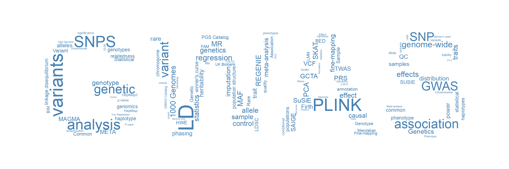

# GWASTutorial

This tutorial provides hands-on training in Complex Trait Genomics for the course `Basic Seminar II` at [The Laboratory of Complex Trait Genomics](https://sites.google.com/edu.k.u-tokyo.ac.jp/kamatanilab/), University of Tokyo. See [About](https://cloufield.github.io/GWASTutorial/99_About/) for details. Questions or suggestions? Please use the [Issue section](https://github.com/Cloufield/GWASTutorial/issues).

## What is GWAS?

A Genome-Wide Association Study (GWAS) is a research approach that investigates the **association** between **genetic variants** (typically SNPs) and **traits** across the entire genome to discover genetic factors that contribute to complex traits and diseases.

## Why Study GWAS and Statistical Genetics?

GWAS and statistical genetics are revolutionizing our understanding of human biology and medicine. These fields are fundamental to modern genetics research, enabling the discovery of genetic risk factors for common diseases, uncovering biological mechanisms, advancing personalized medicine through polygenic risk prediction, and identifying novel drug targets. 

As genetic datasets grow exponentially and precision medicine gains widespread adoption, expertise in GWAS and statistical genetics is increasingly essential for researchers across genomics, medicine, public health, and biotechnology.

## Study Aim

This tutorial aims to provide comprehensive, hands-on training in genome-wide association studies (GWAS) and complex trait genomics. Through practical exercises and detailed explanations, students will learn to:

- Understand the fundamental concepts and methodologies of GWAS
- Perform data quality control, association testing
- Interpret and visualize GWAS results
- Apply post-GWAS analyses including heritability estimation, fine-mapping, and polygenic risk scoring
- Develop proficiency in the computational tools and statistical methods essential for modern genetic research

## Contents

| Category | Topic | Description |
|----------|-------|-------------|
| **Introduction** | [Introduction](https://cloufield.github.io/GWASTutorial/00_Introduction/) | Essential background knowledge for understanding genome-wide association studies (GWAS) and complex trait genomics. |
| **Command Line Tools - Linux** | [Linux command line basics](https://cloufield.github.io/GWASTutorial/02_Linux_basics/) | For those who haven't used the command line, we will first introduce the basics of the Linux system and commonly used commands. |
| **Pre-GWAS** | [1000 Genomes Project](https://cloufield.github.io/GWASTutorial/40_1000_genome_project/) | Comprehensive catalog of human genetic variation providing reference data for GWAS and imputation. |
| | [Sample Dataset](https://cloufield.github.io/GWASTutorial/01_Dataset/) | Sample dataset of 504 East Asian individuals from 1000 Genomes Project for tutorial exercises. |
| | [Data formats](https://cloufield.github.io/GWASTutorial/03_Data_formats/) | Before any analysis, the first thing is always to get familiar with your data. In this section, we will introduce some basic formats used to store sequence, genotype and dosage data. |
| | [Data QC](https://cloufield.github.io/GWASTutorial/04_Data_QC/) | Usually the raw genotype data is "dirty". This means that there are usually errors, invalid or missing values. In this section, we will learn how to perform quality control for the raw genotype data using PLINK. |
| | [Principal component analysis (PCA)](https://cloufield.github.io/GWASTutorial/05_PCA/) | In this section, we will cover how to perform Principal Component Analysis (PCA) to analyze the population structure. |
| | [Phasing](https://cloufield.github.io/GWASTutorial/Phasing/) | Determining the haplotypes (parental chromosome origin) of genetic variants. |
| | [Imputation](https://cloufield.github.io/GWASTutorial/Imputation/) | Predicting ungenotyped variants using reference panels and LD patterns. |
| **GWAS** | [Association tests](https://cloufield.github.io/GWASTutorial/06_Association_tests/) | After QC, we will perform the very first association tests for a simulated binary trait (case-control trait) with a logistic regression model using PLINK. |
| | [Visualization](https://cloufield.github.io/GWASTutorial/Visualization/) | To visualize the summary statistics generated from association tests, we will use a python package called gwaslab to create Manhattan plots, Quantile-Quantile plots and Regional plots. |
| | [Linear mixed model (LMM)](https://cloufield.github.io/GWASTutorial/33_linear_mixed_model/) | Statistical framework to account for population structure, cryptic relatedness, and confounding in GWAS. |
| | [Whole genome regression by REGENIE](https://cloufield.github.io/GWASTutorial/32_whole_genome_regression/) | Computationally efficient whole-genome regression method for large-scale GWAS with multiple phenotypes. |
| | [Rare variant association tests](https://cloufield.github.io/GWASTutorial/34_rare_variant/) | Methods for testing associations of rare variants by aggregating information across variants in genes or regions. |
| | [Saddlepoint approximation (SAIGE)](https://cloufield.github.io/GWASTutorial/35_saddlepoint_approximation/) | Accurate p-value calculation for binary traits with unbalanced case-control ratios using saddlepoint approximation. |
| **Post-GWAS** | [Variant Annotation by ANNOVAR/VEP](https://cloufield.github.io/GWASTutorial/07_Annotation/) | Annotating genetic variants with functional information including gene location, consequence, and population frequency. |
| | [SNP-Heritability estimation by GCTA-GREML](https://cloufield.github.io/GWASTutorial/14_gcta_greml/) | Estimating the proportion of phenotypic variance explained by all SNPs using linear mixed models. |
| | [LD score regression (univariate, cross-trait and partitioned) by LDSC](https://cloufield.github.io/GWASTutorial/08_LDSC/) | Method to estimate heritability, genetic correlation, and cell-type specificity from GWAS summary statistics. |
| | [Gene / Gene-set analysis by MAGMA](https://cloufield.github.io/GWASTutorial/09_Gene_based_analysis/) | Testing associations at the gene and gene-set level by aggregating variant-level signals within genes. |
| | [Fine-mapping by SUSIE](https://cloufield.github.io/GWASTutorial/12_fine_mapping/) | Identifying the most likely causal variant(s) within a genomic region showing significant association. |
| | [Meta-analysis](https://cloufield.github.io/GWASTutorial/11_meta_analysis/) | Combining evidence from multiple GWAS studies to increase statistical power and improve effect size estimation. |
| | [Polygenic risk scores](https://cloufield.github.io/GWASTutorial/10_PRS/) | Calculating genetic risk scores by summing effect sizes of trait-associated variants weighted by their effects. |
| | [Mendelian randomization](https://cloufield.github.io/GWASTutorial/16_mendelian_randomization/) | Using genetic variants as instrumental variables to infer causal relationships between exposures and outcomes. |
| | [Conditional analysis](https://cloufield.github.io/GWASTutorial/18_Conditioning_analysis/) | Identifying independent association signals within a locus by conditioning on lead variants. |
| | [Colocalization](https://cloufield.github.io/GWASTutorial/17_colocalization/) | Testing whether two traits share the same causal variant in a genomic region to support causal inference. |
| | [TWAS](https://cloufield.github.io/GWASTutorial/21_twas/) | Transcriptome-wide association study to identify genes whose expression is associated with traits using expression imputation. |
| **Topics** | [Linkage disequilibrium (LD)](https://cloufield.github.io/GWASTutorial/19_ld/) | Non-random association of alleles at different loci, fundamental concept for understanding GWAS results. |
| | [Heritability Concepts](https://cloufield.github.io/GWASTutorial/13_heritability/) | Understanding how much phenotypic variation can be explained by genetic variation (broad-sense and narrow-sense heritability). |
| | [Power analysis for GWAS](https://cloufield.github.io/GWASTutorial/20_power_analysis/) | Calculating statistical power to detect associations given sample size, effect size, allele frequency, and significance threshold. |
| | [Winner's curse](https://cloufield.github.io/GWASTutorial/15_winners_curse/) | Systematic overestimation of genetic effect sizes when variants are selected based on significance thresholds. |
| | [Study design and phenotype definition](https://cloufield.github.io/GWASTutorial/27_study_design/) | Study design principles for case/control selection, covariates, trait transformations, and phenotype QC. |
| | [Relatedness and sample structure](https://cloufield.github.io/GWASTutorial/28_relatedness/) | Identifying related samples, handling duplicates, and choosing family-based vs population GWAS designs. |
| | [Measure of effect](https://cloufield.github.io/GWASTutorial/55_measure_of_effect/) | Understanding different measures of genetic effect including odds ratio, relative risk, and hazard ratio. |
| **Others** | [Recommended reading](https://cloufield.github.io/GWASTutorial/90_Recommended_Reading/) | Curated list of textbooks, review articles, and topic-specific papers for further learning. |

---

© 2022 - 2026 GWASTutorial
