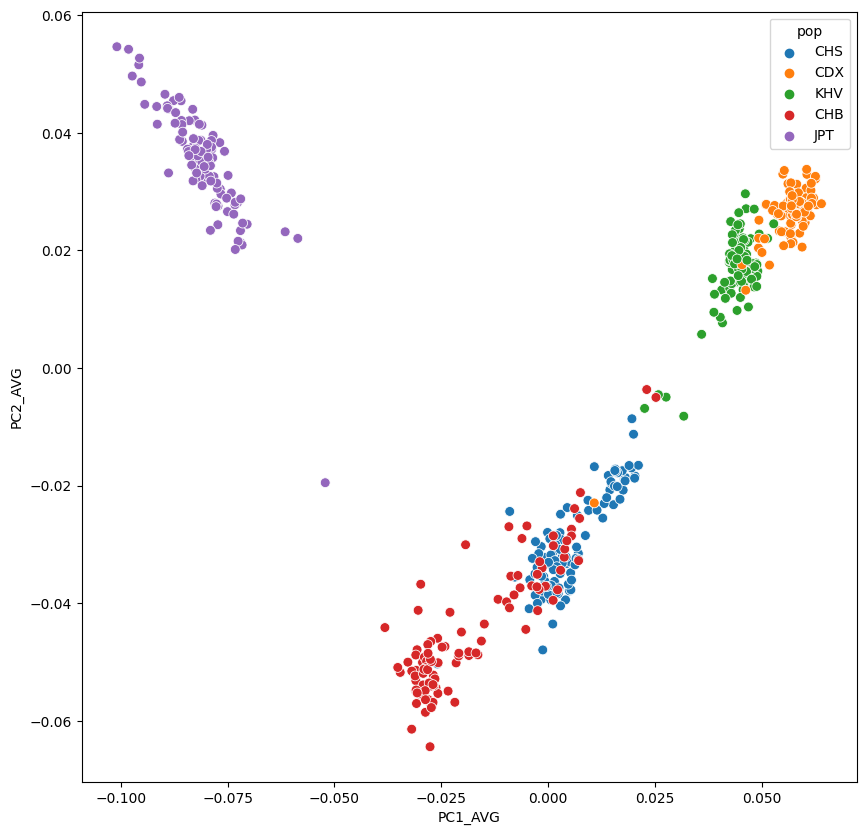

# Plotting PCA


```python
import pandas as pd
import matplotlib.pyplot as plt
import seaborn as sns

```

# loading files


```python
pca = pd.read_table("../05_PCA/plink_results_projected.sscore",sep="\t")
pca

```

| #FID | IID | ALLELE_CT | NAMED_ALLELE_DOSAGE_SUM | PC1_AVG | PC2_AVG | PC3_AVG | PC4_AVG | PC5_AVG | PC6_AVG | PC7_AVG | PC8_AVG | PC9_AVG | PC10_AVG |
| --- | --- | --- | --- | --- | --- | --- | --- | --- | --- | --- | --- | --- | --- |
| HG00403 | HG00403 | 390256 | 390256 | 0.002903 | -0.024865 | 0.010041 | 0.009576 | 0.006943 | -0.002223 | 0.008223 | -0.001149 | 0.003352 | 0.004375 |
| HG00404 | HG00404 | 390696 | 390696 | -0.000141 | -0.027965 | 0.025389 | -0.005825 | -0.002747 | 0.006585 | 0.011380 | 0.007777 | 0.015998 | 0.017893 |
| HG00406 | HG00406 | 388524 | 388524 | 0.007074 | -0.031545 | -0.004370 | -0.001262 | -0.011493 | -0.005395 | -0.006202 | 0.004524 | -0.000871 | -0.002280 |
| HG00407 | HG00407 | 388808 | 388808 | 0.006840 | -0.025073 | -0.006527 | 0.006797 | -0.011600 | -0.010233 | 0.013957 | 0.006187 | 0.013806 | 0.008253 |
| HG00409 | HG00409 | 391646 | 391646 | 0.000399 | -0.029033 | -0.018935 | -0.001360 | 0.029044 | 0.009428 | -0.017119 | -0.012964 | 0.025360 | 0.022907 |
| ... | ... | ... | ... | ... | ... | ... | ... | ... | ... | ... | ... | ... | ... |
| NA19087 | NA19087 | 390232 | 390232 | -0.082261 | 0.033163 | 0.045499 | -0.011398 | 0.000027 | -0.006525 | 0.012446 | -0.006743 | -0.016312 | 0.023022 |
| NA19088 | NA19088 | 391510 | 391510 | -0.087183 | 0.043433 | 0.040188 | 0.003610 | -0.000165 | 0.002317 | 0.000117 | 0.007430 | -0.011886 | 0.007730 |
| NA19089 | NA19089 | 391462 | 391462 | -0.084082 | 0.036118 | -0.036355 | 0.008738 | -0.037523 | 0.004110 | 0.008653 | -0.000563 | -0.001599 | 0.015941 |
| NA19090 | NA19090 | 392880 | 392880 | -0.073580 | 0.026163 | -0.032193 | 0.006599 | -0.039060 | 0.000687 | 0.012213 | -0.000485 | -0.000336 | -0.031283 |
| NA19091 | NA19091 | 389664 | 389664 | -0.081632 | 0.041455 | -0.032200 | 0.003717 | -0.046712 | 0.015191 | 0.003119 | -0.004906 | -0.001811 | -0.020752 |


```python
ped = pd.read_table("../01_Dataset/integrated_call_samples_v3.20130502.ALL.panel",sep="\t")
ped

```

| sample | pop | super_pop | gender | Unnamed: 4 | Unnamed: 5 |
| --- | --- | --- | --- | --- | --- |
| HG00096 | GBR | EUR | male | NaN | NaN |
| HG00097 | GBR | EUR | female | NaN | NaN |
| HG00099 | GBR | EUR | female | NaN | NaN |
| HG00100 | GBR | EUR | female | NaN | NaN |
| HG00101 | GBR | EUR | male | NaN | NaN |
| ... | ... | ... | ... | ... | ... |
| NA21137 | GIH | SAS | female | NaN | NaN |
| NA21141 | GIH | SAS | female | NaN | NaN |
| NA21142 | GIH | SAS | female | NaN | NaN |
| NA21143 | GIH | SAS | female | NaN | NaN |
| NA21144 | GIH | SAS | female | NaN | NaN |

# Merge PCA and population information


```python
pcaped=pd.merge(pca,ped,right_on="sample",left_on="IID",how="inner")
pcaped

```

| #FID | IID | ALLELE_CT | NAMED_ALLELE_DOSAGE_SUM | PC1_AVG | PC2_AVG | PC3_AVG | PC4_AVG | PC5_AVG | PC6_AVG | PC7_AVG | PC8_AVG | PC9_AVG | PC10_AVG | sample | pop | super_pop | gender | Unnamed: 4 | Unnamed: 5 |
| --- | --- | --- | --- | --- | --- | --- | --- | --- | --- | --- | --- | --- | --- | --- | --- | --- | --- | --- | --- |
| HG00403 | HG00403 | 390256 | 390256 | 0.002903 | -0.024865 | 0.010041 | 0.009576 | 0.006943 | -0.002223 | 0.008223 | -0.001149 | 0.003352 | 0.004375 | HG00403 | CHS | EAS | male | NaN | NaN |
| HG00404 | HG00404 | 390696 | 390696 | -0.000141 | -0.027965 | 0.025389 | -0.005825 | -0.002747 | 0.006585 | 0.011380 | 0.007777 | 0.015998 | 0.017893 | HG00404 | CHS | EAS | female | NaN | NaN |
| HG00406 | HG00406 | 388524 | 388524 | 0.007074 | -0.031545 | -0.004370 | -0.001262 | -0.011493 | -0.005395 | -0.006202 | 0.004524 | -0.000871 | -0.002280 | HG00406 | CHS | EAS | male | NaN | NaN |
| HG00407 | HG00407 | 388808 | 388808 | 0.006840 | -0.025073 | -0.006527 | 0.006797 | -0.011600 | -0.010233 | 0.013957 | 0.006187 | 0.013806 | 0.008253 | HG00407 | CHS | EAS | female | NaN | NaN |
| HG00409 | HG00409 | 391646 | 391646 | 0.000399 | -0.029033 | -0.018935 | -0.001360 | 0.029044 | 0.009428 | -0.017119 | -0.012964 | 0.025360 | 0.022907 | HG00409 | CHS | EAS | male | NaN | NaN |
| ... | ... | ... | ... | ... | ... | ... | ... | ... | ... | ... | ... | ... | ... | ... | ... | ... | ... | ... | ... |
| NA19087 | NA19087 | 390232 | 390232 | -0.082261 | 0.033163 | 0.045499 | -0.011398 | 0.000027 | -0.006525 | 0.012446 | -0.006743 | -0.016312 | 0.023022 | NA19087 | JPT | EAS | female | NaN | NaN |
| NA19088 | NA19088 | 391510 | 391510 | -0.087183 | 0.043433 | 0.040188 | 0.003610 | -0.000165 | 0.002317 | 0.000117 | 0.007430 | -0.011886 | 0.007730 | NA19088 | JPT | EAS | male | NaN | NaN |
| NA19089 | NA19089 | 391462 | 391462 | -0.084082 | 0.036118 | -0.036355 | 0.008738 | -0.037523 | 0.004110 | 0.008653 | -0.000563 | -0.001599 | 0.015941 | NA19089 | JPT | EAS | male | NaN | NaN |
| NA19090 | NA19090 | 392880 | 392880 | -0.073580 | 0.026163 | -0.032193 | 0.006599 | -0.039060 | 0.000687 | 0.012213 | -0.000485 | -0.000336 | -0.031283 | NA19090 | JPT | EAS | female | NaN | NaN |
| NA19091 | NA19091 | 389664 | 389664 | -0.081632 | 0.041455 | -0.032200 | 0.003717 | -0.046712 | 0.015191 | 0.003119 | -0.004906 | -0.001811 | -0.020752 | NA19091 | JPT | EAS | male | NaN | NaN |

# Plotting


```python
plt.figure(figsize=(10,10))
sns.scatterplot(data=pcaped,x="PC1_AVG",y="PC2_AVG",hue="pop",s=50)

```


```
<Axes: xlabel='PC1_AVG', ylabel='PC2_AVG'>

```


