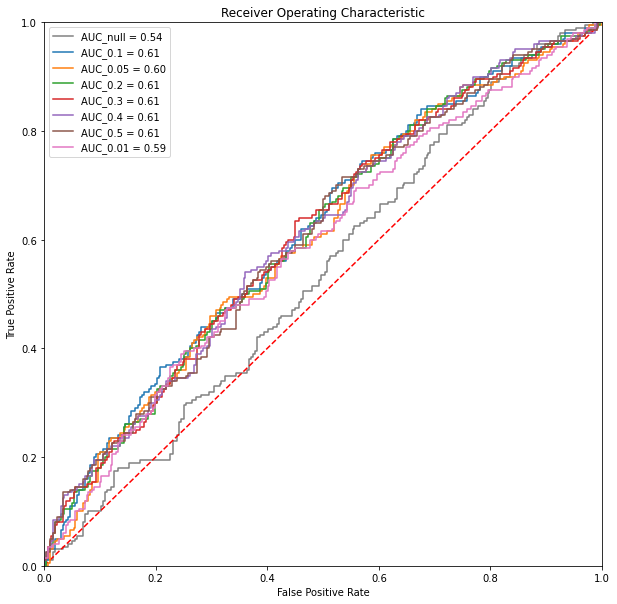
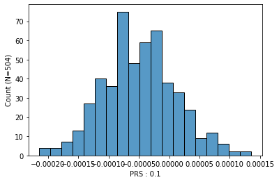
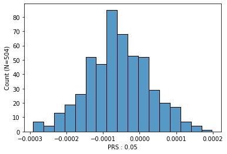
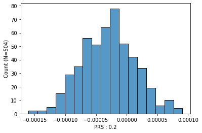
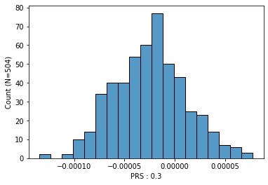
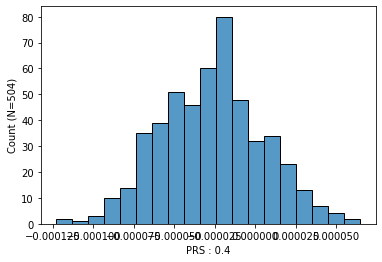
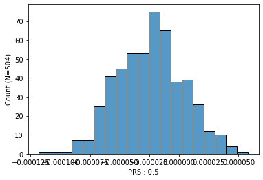
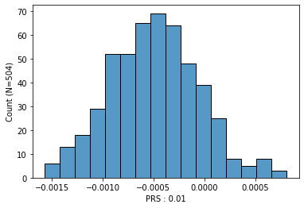

```python
import sys
sys.path.insert(0,"/Users/he/work/PRSlink/src")
import prslink as pl

```


```python
a= pl.PRS()

```


```python
a.add_score("./1kgeas.0.1.profile",  "IID",["SCORE"],["0.1"],sep="\s+")
a.add_score("./1kgeas.0.05.profile", "IID",["SCORE"],["0.05"],sep="\s+")
a.add_score("./1kgeas.0.2.profile",  "IID",["SCORE"],["0.2"],sep="\s+")
a.add_score("./1kgeas.0.3.profile",  "IID",["SCORE"],["0.3"],sep="\s+")
a.add_score("./1kgeas.0.4.profile",  "IID",["SCORE"],["0.4"],sep="\s+")
a.add_score("./1kgeas.0.5.profile",  "IID",["SCORE"],["0.5"],sep="\s+")
a.add_score("./1kgeas.0.001.profile","IID",["SCORE"],["0.01"],sep="\s+")

```

**stdout:**

```
- Dataset shape before loading : (0, 1)
- Loading score data from file: ./1kgeas.0.1.profile
  - Setting ID:IID
  - Loading score:SCORE
  - Loaded columns: 0.1
  - Overlapping IDs:0
- Loading finished successfully!
- Dataset shape after loading : (504, 2)
- Dataset shape before loading : (504, 2)
- Loading score data from file: ./1kgeas.0.05.profile
  - Setting ID:IID
  - Loading score:SCORE
  - Loaded columns: 0.05
  - Overlapping IDs:504
- Loading finished successfully!
- Dataset shape after loading : (504, 3)
- Dataset shape before loading : (504, 3)
- Loading score data from file: ./1kgeas.0.2.profile
  - Setting ID:IID
  - Loading score:SCORE
  - Loaded columns: 0.2
  - Overlapping IDs:504
- Loading finished successfully!
- Dataset shape after loading : (504, 4)
- Dataset shape before loading : (504, 4)
- Loading score data from file: ./1kgeas.0.3.profile
  - Setting ID:IID
  - Loading score:SCORE
  - Loaded columns: 0.3
  - Overlapping IDs:504
- Loading finished successfully!
- Dataset shape after loading : (504, 5)
- Dataset shape before loading : (504, 5)
- Loading score data from file: ./1kgeas.0.4.profile
  - Setting ID:IID
  - Loading score:SCORE
  - Loaded columns: 0.4
  - Overlapping IDs:504
- Loading finished successfully!
- Dataset shape after loading : (504, 6)
- Dataset shape before loading : (504, 6)
- Loading score data from file: ./1kgeas.0.5.profile
  - Setting ID:IID
  - Loading score:SCORE
  - Loaded columns: 0.5
  - Overlapping IDs:504
- Loading finished successfully!
- Dataset shape after loading : (504, 7)
- Dataset shape before loading : (504, 7)
- Loading score data from file: ./1kgeas.0.001.profile
  - Setting ID:IID
  - Loading score:SCORE
  - Loaded columns: 0.01
  - Overlapping IDs:504
- Loading finished successfully!
- Dataset shape after loading : (504, 8)

```


```python
a.add_pheno("../01_Dataset/t2d/1kgeas_t2d.txt","IID",["T2D"],types="B",sep="\s+")

```

**stdout:**

```
- Dataset shape before loading : (504, 8)
- Loading pheno data from file: ../01_Dataset/t2d/1kgeas_t2d.txt
  - Setting ID:IID
  - Loading pheno:T2D
  - Loaded columns: T2D
  - Overlapping IDs:504
- Loading finished successfully!
- Dataset shape after loading : (504, 9)

```


```python
a.add_covar("./1kgeas.eigenvec","IID",["PC1","PC2","PC3","PC4","PC5"],sep="\s+")

```

**stdout:**

```
- Dataset shape before loading : (504, 9)
- Loading covar data from file: ./1kgeas.eigenvec
  - Setting ID:IID
  - Loading covar:PC1 PC2 PC3 PC4 PC5
  - Loaded columns: PC1 PC2 PC3 PC4 PC5
  - Overlapping IDs:504
- Loading finished successfully!
- Dataset shape after loading : (504, 14)

```


```python
a.data["T2D"] = a.data["T2D"]-1

```


```python
a.data

```

| IID | 0.1 | 0.05 | 0.2 | 0.3 | 0.4 | 0.5 | 0.01 | T2D | PC1 | PC2 | PC3 | PC4 | PC5 |
| --- | --- | --- | --- | --- | --- | --- | --- | --- | --- | --- | --- | --- | --- |
| HG00403 | -0.000061 | -2.812450e-05 | -0.000019 | -2.131690e-05 | -0.000024 | -0.000022 | 0.000073 | 0 | 0.000107 | 0.039080 | 0.021048 | 0.016633 | 0.063373 |
| HG00404 | 0.000025 | 4.460810e-07 | 0.000041 | 4.370760e-05 | 0.000024 | 0.000018 | 0.000156 | 1 | -0.001216 | 0.045148 | 0.009013 | 0.028122 | 0.041474 |
| HG00406 | 0.000011 | 2.369040e-05 | -0.000009 | 2.928090e-07 | -0.000010 | -0.000008 | -0.000188 | 0 | 0.005020 | 0.044668 | 0.016583 | 0.020077 | -0.031782 |
| HG00407 | -0.000133 | -1.326670e-04 | -0.000069 | -5.677710e-05 | -0.000062 | -0.000057 | -0.000744 | 1 | 0.005408 | 0.034132 | 0.014955 | 0.003872 | 0.009794 |
| HG00409 | 0.000010 | -3.120730e-07 | -0.000012 | -1.873660e-05 | -0.000025 | -0.000023 | -0.000367 | 1 | -0.002121 | 0.031752 | -0.048352 | -0.043185 | 0.064674 |
| ... | ... | ... | ... | ... | ... | ... | ... | ... | ... | ... | ... | ... | ... |
| NA19087 | -0.000042 | -6.215880e-05 | -0.000038 | -1.116230e-05 | -0.000019 | -0.000018 | -0.000397 | 0 | -0.067583 | -0.040340 | 0.015038 | 0.039039 | -0.010774 |
| NA19088 | 0.000085 | 9.058670e-05 | 0.000047 | 2.666260e-05 | 0.000016 | 0.000014 | 0.000723 | 0 | -0.069752 | -0.047710 | 0.028578 | 0.036714 | -0.000906 |
| NA19089 | -0.000067 | -4.767610e-05 | -0.000011 | -1.393760e-05 | -0.000019 | -0.000016 | -0.000126 | 0 | -0.073989 | -0.046706 | 0.040089 | -0.034719 | -0.062692 |
| NA19090 | 0.000064 | 3.989030e-05 | 0.000022 | 7.445850e-06 | 0.000010 | 0.000003 | -0.000149 | 0 | -0.061156 | -0.034606 | 0.032674 | -0.016363 | -0.065390 |
| NA19091 | 0.000051 | 4.469220e-05 | 0.000043 | 3.089720e-05 | 0.000019 | 0.000016 | 0.000028 | 0 | -0.067749 | -0.052950 | 0.036908 | -0.023856 | -0.058515 |


```python
a.set_k({"T2D":0.2})

```


```python
a.evaluate(a.pheno_cols, a.score_cols, a.covar_cols,r2_lia=True)

```

**stdout:**

```
 - Binary trait: fitting logistic regression...
 - Binary trait: using records with phenotype being 0 or 1...
Optimization terminated successfully.
         Current function value: 0.668348
         Iterations 5
Optimization terminated successfully.
         Current function value: 0.653338
         Iterations 5
Optimization terminated successfully.
         Current function value: 0.657903
         Iterations 5
Optimization terminated successfully.
         Current function value: 0.654492
         Iterations 5
Optimization terminated successfully.
         Current function value: 0.654413
         Iterations 5
Optimization terminated successfully.
         Current function value: 0.653085
         Iterations 5
Optimization terminated successfully.
         Current function value: 0.654681
         Iterations 5
Optimization terminated successfully.
         Current function value: 0.661290
         Iterations 5

```

| PHENO | TYPE | PRS | N_CASE | N | BETA | CI_L | CI_U | P | R2_null | R2_full | Delta_R2 | AUC_null | AUC_full | Delta_AUC | R2_lia_null | R2_lia_full | Delta_R2_lia | SE |
| --- | --- | --- | --- | --- | --- | --- | --- | --- | --- | --- | --- | --- | --- | --- | --- | --- | --- | --- |
| T2D | B | 0.01 | 200 | 502 | 0.250643 | 0.064512 | 0.436773 | 0.008308 | 0.010809 | 0.029616 | 0.018808 | 0.536921 | 0.586821 | 0.049901 | 0.010729 | 0.029826 | 0.019096 | NaN |
| T2D | B | 0.05 | 200 | 502 | 0.310895 | 0.119814 | 0.501976 | 0.001428 | 0.010809 | 0.038545 | 0.027736 | 0.536921 | 0.601987 | 0.065066 | 0.010729 | 0.038925 | 0.028196 | NaN |
| T2D | B | 0.5 | 200 | 502 | 0.367803 | 0.169184 | 0.566421 | 0.000284 | 0.010809 | 0.046985 | 0.036176 | 0.536921 | 0.605397 | 0.068477 | 0.010729 | 0.047553 | 0.036824 | NaN |
| T2D | B | 0.2 | 200 | 502 | 0.365641 | 0.169678 | 0.561604 | 0.000255 | 0.010809 | 0.047479 | 0.036670 | 0.536921 | 0.607318 | 0.070397 | 0.010729 | 0.048079 | 0.037349 | NaN |
| T2D | B | 0.3 | 200 | 502 | 0.367788 | 0.171062 | 0.564515 | 0.000248 | 0.010809 | 0.047686 | 0.036877 | 0.536921 | 0.608493 | 0.071573 | 0.010729 | 0.048315 | 0.037585 | NaN |
| T2D | B | 0.1 | 200 | 502 | 0.374750 | 0.181520 | 0.567979 | 0.000144 | 0.010809 | 0.050488 | 0.039679 | 0.536921 | 0.613957 | 0.077036 | 0.010729 | 0.051270 | 0.040540 | NaN |
| T2D | B | 0.4 | 200 | 502 | 0.389232 | 0.189866 | 0.588597 | 0.000130 | 0.010809 | 0.051145 | 0.040336 | 0.536921 | 0.609238 | 0.072318 | 0.010729 | 0.051845 | 0.041116 | NaN |


```python
a.plot_roc(a.pheno_cols, a.score_cols, a.covar_cols)

```

**stdout:**

```
Optimization terminated successfully.
         Current function value: 0.668348
         Iterations 5

```




```python
a.plot_prs(a.score_cols)

```














