```python
import prslink as pl

```


```python
a= pl.PRS()

```

**stdout:**

```
Thu Jun 13 12:28:18 2024 PRSLink v0.0.1
Thu Jun 13 12:28:18 2024 (C) 2023-2024, Yunye He, Kamatani Lab, MIT License, gwaslab@gmail.com

```


```python
a.add_score("./1kgeas.pT0.1.sscore",  "#IID",["SCORE1_AVG"],["pT0.1"],sep="\s+")
a.add_score("./1kgeas.pT0.05.sscore", "#IID",["SCORE1_AVG"],["pT0.05"],sep="\s+")
a.add_score("./1kgeas.pT0.2.sscore",  "#IID",["SCORE1_AVG"],["pT0.2"],sep="\s+")
a.add_score("./1kgeas.pT0.3.sscore",  "#IID",["SCORE1_AVG"],["pT0.3"],sep="\s+")
a.add_score("./1kgeas.pT0.4.sscore",  "#IID",["SCORE1_AVG"],["pT0.4"],sep="\s+")
a.add_score("./1kgeas.pT0.5.sscore",  "#IID",["SCORE1_AVG"],["pT0.5"],sep="\s+")
a.add_score("./1kgeas.pT0.001.sscore","#IID",["SCORE1_AVG"],["pT0.01"],sep="\s+")

```

**stdout:**

```
Thu Jun 13 12:28:18 2024 Start loading datasets...
Thu Jun 13 12:28:18 2024 - Dataset shape before loading : (0, 1)
Thu Jun 13 12:28:18 2024 - Loading score data from file: ./1kgeas.pT0.1.sscore
Thu Jun 13 12:28:18 2024   - Setting ID:#IID
Thu Jun 13 12:28:18 2024   - Loading score:SCORE1_AVG
Thu Jun 13 12:28:18 2024   - Loaded columns: pT0.1
Thu Jun 13 12:28:18 2024   - Overlapping IDs:0
Thu Jun 13 12:28:18 2024   - Merging to main dataset...
Thu Jun 13 12:28:18 2024   - Added new IDs : 500
Thu Jun 13 12:28:18 2024 - Loading finished successfully!
Thu Jun 13 12:28:18 2024 - Dataset shape after loading : (500, 2)
Thu Jun 13 12:28:18 2024 Finished loading datasets...
Thu Jun 13 12:28:18 2024 Start loading datasets...
Thu Jun 13 12:28:18 2024 - Dataset shape before loading : (500, 2)
Thu Jun 13 12:28:18 2024 - Loading score data from file: ./1kgeas.pT0.05.sscore
Thu Jun 13 12:28:18 2024   - Setting ID:#IID
Thu Jun 13 12:28:18 2024   - Loading score:SCORE1_AVG
Thu Jun 13 12:28:18 2024   - Loaded columns: pT0.05
Thu Jun 13 12:28:18 2024   - Overlapping IDs:500
Thu Jun 13 12:28:18 2024   - Merging to main dataset...
Thu Jun 13 12:28:18 2024 - Loading finished successfully!
Thu Jun 13 12:28:18 2024 - Dataset shape after loading : (500, 3)
Thu Jun 13 12:28:18 2024 Finished loading datasets...
Thu Jun 13 12:28:18 2024 Start loading datasets...
Thu Jun 13 12:28:18 2024 - Dataset shape before loading : (500, 3)
Thu Jun 13 12:28:18 2024 - Loading score data from file: ./1kgeas.pT0.2.sscore
Thu Jun 13 12:28:18 2024   - Setting ID:#IID
Thu Jun 13 12:28:18 2024   - Loading score:SCORE1_AVG
Thu Jun 13 12:28:18 2024   - Loaded columns: pT0.2
Thu Jun 13 12:28:18 2024   - Overlapping IDs:500
Thu Jun 13 12:28:18 2024   - Merging to main dataset...
Thu Jun 13 12:28:18 2024 - Loading finished successfully!
Thu Jun 13 12:28:18 2024 - Dataset shape after loading : (500, 4)
Thu Jun 13 12:28:18 2024 Finished loading datasets...
Thu Jun 13 12:28:18 2024 Start loading datasets...
Thu Jun 13 12:28:18 2024 - Dataset shape before loading : (500, 4)
Thu Jun 13 12:28:18 2024 - Loading score data from file: ./1kgeas.pT0.3.sscore
Thu Jun 13 12:28:18 2024   - Setting ID:#IID
Thu Jun 13 12:28:18 2024   - Loading score:SCORE1_AVG
Thu Jun 13 12:28:18 2024   - Loaded columns: pT0.3
Thu Jun 13 12:28:18 2024   - Overlapping IDs:500
Thu Jun 13 12:28:18 2024   - Merging to main dataset...
Thu Jun 13 12:28:18 2024 - Loading finished successfully!
Thu Jun 13 12:28:18 2024 - Dataset shape after loading : (500, 5)
Thu Jun 13 12:28:18 2024 Finished loading datasets...
Thu Jun 13 12:28:18 2024 Start loading datasets...
Thu Jun 13 12:28:18 2024 - Dataset shape before loading : (500, 5)
Thu Jun 13 12:28:18 2024 - Loading score data from file: ./1kgeas.pT0.4.sscore
Thu Jun 13 12:28:18 2024   - Setting ID:#IID
Thu Jun 13 12:28:18 2024   - Loading score:SCORE1_AVG
Thu Jun 13 12:28:18 2024   - Loaded columns: pT0.4
Thu Jun 13 12:28:18 2024   - Overlapping IDs:500
Thu Jun 13 12:28:18 2024   - Merging to main dataset...
Thu Jun 13 12:28:18 2024 - Loading finished successfully!
Thu Jun 13 12:28:18 2024 - Dataset shape after loading : (500, 6)
Thu Jun 13 12:28:18 2024 Finished loading datasets...
Thu Jun 13 12:28:18 2024 Start loading datasets...
Thu Jun 13 12:28:18 2024 - Dataset shape before loading : (500, 6)
Thu Jun 13 12:28:18 2024 - Loading score data from file: ./1kgeas.pT0.5.sscore
Thu Jun 13 12:28:18 2024   - Setting ID:#IID
Thu Jun 13 12:28:18 2024   - Loading score:SCORE1_AVG
Thu Jun 13 12:28:18 2024   - Loaded columns: pT0.5
Thu Jun 13 12:28:18 2024   - Overlapping IDs:500
Thu Jun 13 12:28:18 2024   - Merging to main dataset...
Thu Jun 13 12:28:18 2024 - Loading finished successfully!
Thu Jun 13 12:28:18 2024 - Dataset shape after loading : (500, 7)
Thu Jun 13 12:28:18 2024 Finished loading datasets...
Thu Jun 13 12:28:18 2024 Start loading datasets...
Thu Jun 13 12:28:18 2024 - Dataset shape before loading : (500, 7)
Thu Jun 13 12:28:18 2024 - Loading score data from file: ./1kgeas.pT0.001.sscore
Thu Jun 13 12:28:18 2024   - Setting ID:#IID
Thu Jun 13 12:28:18 2024   - Loading score:SCORE1_AVG
Thu Jun 13 12:28:18 2024   - Loaded columns: pT0.01
Thu Jun 13 12:28:18 2024   - Overlapping IDs:500
Thu Jun 13 12:28:18 2024   - Merging to main dataset...
Thu Jun 13 12:28:18 2024 - Loading finished successfully!
Thu Jun 13 12:28:18 2024 - Dataset shape after loading : (500, 8)
Thu Jun 13 12:28:18 2024 Finished loading datasets...

```


```python
a.add_pheno("../01_Dataset/t2d/1kgeas_t2d.txt","IID",["T2D"],types="B",sep="\s+")

```

**stdout:**

```
Thu Jun 13 12:28:19 2024 Start loading datasets...
Thu Jun 13 12:28:19 2024 - Dataset shape before loading : (500, 8)
Thu Jun 13 12:28:19 2024 - Loading pheno data from file: ../01_Dataset/t2d/1kgeas_t2d.txt
Thu Jun 13 12:28:19 2024   - Setting ID:IID
Thu Jun 13 12:28:19 2024   - Loading pheno:T2D
Thu Jun 13 12:28:19 2024   - Loaded columns: T2D
Thu Jun 13 12:28:19 2024   - Overlapping IDs:500
Thu Jun 13 12:28:19 2024   - Merging to main dataset...
Thu Jun 13 12:28:19 2024   - Added new IDs : 4
Thu Jun 13 12:28:19 2024 - Loading finished successfully!
Thu Jun 13 12:28:19 2024 - Dataset shape after loading : (504, 9)
Thu Jun 13 12:28:19 2024 Finished loading datasets...

```


```python
a.add_covar("./1kgeas.eigenvec","IID",["PC1","PC2","PC3","PC4","PC5"],sep="\s+")

```

**stdout:**

```
Thu Jun 13 12:28:19 2024 Start loading datasets...
Thu Jun 13 12:28:19 2024 - Dataset shape before loading : (504, 9)
Thu Jun 13 12:28:19 2024 - Loading covar data from file: ./1kgeas.eigenvec
Thu Jun 13 12:28:19 2024   - Setting ID:IID
Thu Jun 13 12:28:19 2024   - Loading covar:PC1 PC2 PC3 PC4 PC5
Thu Jun 13 12:28:19 2024   - Loaded columns: PC1 PC2 PC3 PC4 PC5
Thu Jun 13 12:28:19 2024   - Overlapping IDs:500
Thu Jun 13 12:28:19 2024   - Merging to main dataset...
Thu Jun 13 12:28:19 2024 - Loading finished successfully!
Thu Jun 13 12:28:19 2024 - Dataset shape after loading : (504, 14)
Thu Jun 13 12:28:19 2024 Finished loading datasets...

```


```python
# convert 1/2 coding to 0/1 coding
a.data["T2D"] = a.data["T2D"]-1

```


```python
a.data

```

| IID | pT0.1 | pT0.05 | pT0.2 | pT0.3 | pT0.4 | pT0.5 | pT0.01 | T2D | PC1 | PC2 | PC3 | PC4 | PC5 |
| --- | --- | --- | --- | --- | --- | --- | --- | --- | --- | --- | --- | --- | --- |
| HG00403 | 2.844550e-05 | -0.000010 | 0.000085 | 0.000070 | 0.000076 | 0.000060 | 1.331020e-05 | 0 | 0.002265 | 0.030121 | -0.009379 | 0.014346 | -0.000008 |
| HG00404 | 5.651720e-05 | 0.000035 | 0.000114 | 0.000111 | 0.000114 | 0.000091 | -5.712170e-05 | 1 | 0.000120 | 0.037074 | 0.005504 | 0.032108 | 0.003675 |
| HG00406 | -3.918720e-05 | -0.000098 | 0.000015 | 0.000037 | 0.000052 | 0.000030 | -3.058490e-04 | 0 | 0.005554 | 0.043812 | -0.001995 | -0.001842 | -0.000286 |
| HG00407 | -9.876060e-05 | -0.000142 | -0.000014 | 0.000012 | 0.000029 | 0.000014 | -9.035270e-04 | 1 | 0.005308 | 0.036650 | -0.013282 | -0.006384 | 0.004915 |
| HG00409 | 1.671570e-05 | 0.000030 | 0.000056 | 0.000054 | 0.000061 | 0.000037 | -4.403280e-04 | 1 | 0.000620 | 0.042519 | -0.006477 | -0.026379 | -0.012448 |
| ... | ... | ... | ... | ... | ... | ... | ... | ... | ... | ... | ... | ... | ... |
| NA19087 | 6.296510e-07 | -0.000033 | 0.000063 | 0.000083 | 0.000088 | 0.000068 | -3.409900e-04 | 0 | -0.075750 | -0.044500 | 0.019200 | 0.073495 | -0.000317 |
| NA19088 | 1.460160e-04 | 0.000170 | 0.000153 | 0.000141 | 0.000135 | 0.000107 | 6.891660e-04 | 0 | -0.076007 | -0.049376 | 0.004827 | 0.061414 | 0.002162 |
| NA19089 | -3.846640e-05 | -0.000047 | 0.000044 | 0.000053 | 0.000059 | 0.000038 | -6.212790e-04 | 0 | -0.077956 | -0.045994 | -0.019492 | -0.073673 | 0.015631 |
| NA19090 | 3.620130e-05 | 0.000042 | 0.000061 | 0.000085 | 0.000099 | 0.000071 | -3.948200e-04 | 0 | -0.065308 | -0.032709 | -0.010401 | -0.050258 | -0.006227 |
| NA19091 | 8.955840e-05 | 0.000044 | 0.000130 | 0.000130 | 0.000131 | 0.000109 | 1.222930e-07 | 0 | -0.076216 | -0.054380 | -0.010428 | -0.059694 | -0.007113 |


```python
# drop missing values
a.data = a.data[a.data["T2D"]>=0]

```


```python
# set population prevalence rate
a.set_k({"T2D":0.2})

```


```python
a.evaluate(a.pheno_cols,
           a.score_cols,
           a.covar_cols,
           r2_lia=True)

```

**stdout:**

```
Thu Jun 13 12:28:24 2024 Strat to evaluate PRS performance...
Optimization terminated successfully.
         Current function value: 0.665421
         Iterations 5
Thu Jun 13 12:28:24 2024  - Fitting Null Logistic: T2D~PC1+PC2+PC3+PC4+PC5
Thu Jun 13 12:28:24 2024  - Fitting Full Logistic : T2D~pT0.1+PC1+PC2+PC3+PC4+PC5
Optimization terminated successfully.
         Current function value: 0.659809
         Iterations 5
Thu Jun 13 12:28:24 2024  - Population prevalence for T2D : 0.2
Thu Jun 13 12:28:24 2024  - Fitting Full Logistic : T2D~pT0.05+PC1+PC2+PC3+PC4+PC5
Optimization terminated successfully.
         Current function value: 0.657462
         Iterations 5
Thu Jun 13 12:28:24 2024  - Population prevalence for T2D : 0.2
Thu Jun 13 12:28:24 2024  - Fitting Full Logistic : T2D~pT0.2+PC1+PC2+PC3+PC4+PC5
Optimization terminated successfully.
         Current function value: 0.658569
         Iterations 5
Thu Jun 13 12:28:24 2024  - Population prevalence for T2D : 0.2
Thu Jun 13 12:28:24 2024  - Fitting Full Logistic : T2D~pT0.3+PC1+PC2+PC3+PC4+PC5
Optimization terminated successfully.
         Current function value: 0.657275
         Iterations 5
Thu Jun 13 12:28:25 2024  - Population prevalence for T2D : 0.2
Thu Jun 13 12:28:25 2024  - Fitting Full Logistic : T2D~pT0.4+PC1+PC2+PC3+PC4+PC5
Optimization terminated successfully.
         Current function value: 0.656994
         Iterations 5
Thu Jun 13 12:28:25 2024  - Population prevalence for T2D : 0.2
Thu Jun 13 12:28:25 2024  - Fitting Full Logistic : T2D~pT0.5+PC1+PC2+PC3+PC4+PC5
Optimization terminated successfully.
         Current function value: 0.657091
         Iterations 5
Thu Jun 13 12:28:25 2024  - Population prevalence for T2D : 0.2
Thu Jun 13 12:28:25 2024  - Fitting Full Logistic : T2D~pT0.01+PC1+PC2+PC3+PC4+PC5
Optimization terminated successfully.
         Current function value: 0.660222
         Iterations 5
Thu Jun 13 12:28:25 2024  - Population prevalence for T2D : 0.2
Thu Jun 13 12:28:25 2024  - Fitted models have been stored into .bmodels and .qmodels
Thu Jun 13 12:28:25 2024  - Results have been stored into .bresults and .qresults
Thu Jun 13 12:28:25 2024 Finished evaluating PRS performance...

```

**stderr:**

```
/home/yunye/anaconda3/envs/gwaslab_py39/lib/python3.9/site-packages/prslink/model_evaluate.py:424: FutureWarning: The behavior of DataFrame concatenation with empty or all-NA entries is deprecated. In a future version, this will no longer exclude empty or all-NA columns when determining the result dtypes. To retain the old behavior, exclude the relevant entries before the concat operation.
  bresults = pd.concat([bresults, row],ignore_index=True)
/home/yunye/anaconda3/envs/gwaslab_py39/lib/python3.9/site-packages/prslink/g_PRS_object.py:157: FutureWarning: The behavior of DataFrame concatenation with empty or all-NA entries is deprecated. In a future version, this will no longer exclude empty or all-NA columns when determining the result dtypes. To retain the old behavior, exclude the relevant entries before the concat operation.
  return pd.concat([bresults,qresults],ignore_index=True)

```

| PHENO | TYPE | PRS | N_CASE | N | BETA | SE | CI_L | CI_U | P | ... | Delta_R2 | AUC_null | AUC_full | Delta_AUC | R2_lia_null | R2_lia_full | Delta_R2_lia | NULL_formula | FULL_formula | NORM |
| --- | --- | --- | --- | --- | --- | --- | --- | --- | --- | --- | --- | --- | --- | --- | --- | --- | --- | --- | --- | --- |
| T2D | B | pT0.01 | 199 | 498 | 0.215648 | 0.095424 | 0.028620 | 0.402675 | 0.023828 | ... | 0.013780 | 0.538226 | 0.581352 | 0.043125 | 0.019143 | 0.033083 | 0.013939 | T2D~PC1+PC2+PC3+PC4+PC5 | T2D~pT0.01+PC1+PC2+PC3+PC4+PC5 | True |
| T2D | B | pT0.1 | 199 | 498 | 0.231887 | 0.098979 | 0.037892 | 0.425882 | 0.019140 | ... | 0.014867 | 0.538226 | 0.579452 | 0.041226 | 0.019143 | 0.034344 | 0.015201 | T2D~PC1+PC2+PC3+PC4+PC5 | T2D~pT0.1+PC1+PC2+PC3+PC4+PC5 | True |
| T2D | B | pT0.2 | 199 | 498 | 0.260394 | 0.100672 | 0.063079 | 0.457708 | 0.009694 | ... | 0.018131 | 0.538226 | 0.581856 | 0.043630 | 0.019143 | 0.037758 | 0.018615 | T2D~PC1+PC2+PC3+PC4+PC5 | T2D~pT0.2+PC1+PC2+PC3+PC4+PC5 | True |
| T2D | B | pT0.05 | 199 | 498 | 0.272784 | 0.098132 | 0.080449 | 0.465120 | 0.005440 | ... | 0.021035 | 0.538226 | 0.590948 | 0.052722 | 0.019143 | 0.040672 | 0.021528 | T2D~PC1+PC2+PC3+PC4+PC5 | T2D~pT0.05+PC1+PC2+PC3+PC4+PC5 | True |
| T2D | B | pT0.3 | 199 | 498 | 0.285854 | 0.101471 | 0.086974 | 0.484734 | 0.004846 | ... | 0.021526 | 0.538226 | 0.585167 | 0.046940 | 0.019143 | 0.041221 | 0.022078 | T2D~PC1+PC2+PC3+PC4+PC5 | T2D~pT0.3+PC1+PC2+PC3+PC4+PC5 | True |
| T2D | B | pT0.5 | 199 | 498 | 0.291207 | 0.102281 | 0.090741 | 0.491673 | 0.004411 | ... | 0.022008 | 0.538226 | 0.586982 | 0.048755 | 0.019143 | 0.041654 | 0.022510 | T2D~PC1+PC2+PC3+PC4+PC5 | T2D~pT0.5+PC1+PC2+PC3+PC4+PC5 | True |
| T2D | B | pT0.4 | 199 | 498 | 0.290829 | 0.101559 | 0.091777 | 0.489881 | 0.004188 | ... | 0.022262 | 0.538226 | 0.586377 | 0.048150 | 0.019143 | 0.041912 | 0.022769 | T2D~PC1+PC2+PC3+PC4+PC5 | T2D~pT0.4+PC1+PC2+PC3+PC4+PC5 | True |


```python
a.plot_roc(a.pheno_cols, a.score_cols, a.covar_cols)

```

**stdout:**

```
Thu Jun 13 12:28:25 2024  -Color map: tab10
Thu Jun 13 12:28:25 2024  -Color number: 7 (head: 0; tail: 0)
Thu Jun 13 12:28:25 2024  -Color map norm: range(0, 7)
Thu Jun 13 12:28:25 2024  -Color to use: ['#1f77b4', '#ff7f0e', '#2ca02c', '#d62728', '#9467bd', '#8c564b', '#e377c2']
Optimization terminated successfully.
         Current function value: 0.665421
         Iterations 5

```

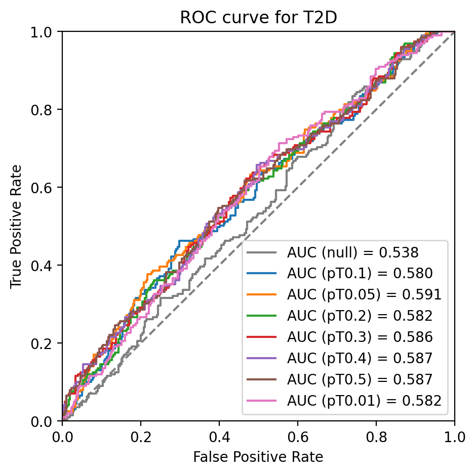


```python
a.plot_prs(scores=a.score_cols,fig_args={"figsize":(10,5)})

```

**stdout:**

```
Thu Jun 13 12:28:26 2024  -Plot args: {}
Thu Jun 13 12:28:26 2024  -Figure args: {'figsize': (10, 5)}
Thu Jun 13 12:28:26 2024  -Color map: coolwarm
Thu Jun 13 12:28:26 2024  -Color number: 2 (head: 0; tail: 0)
Thu Jun 13 12:28:26 2024  -Color map norm: [0.0, 1.0]
Thu Jun 13 12:28:26 2024  -Color to use: ['#3b4cc0', '#b40426']

```

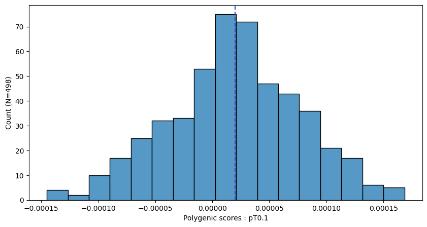

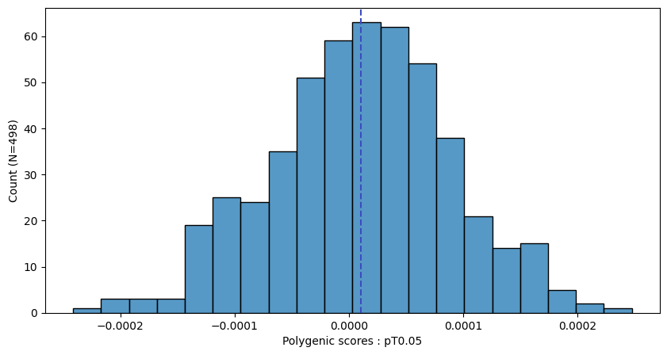

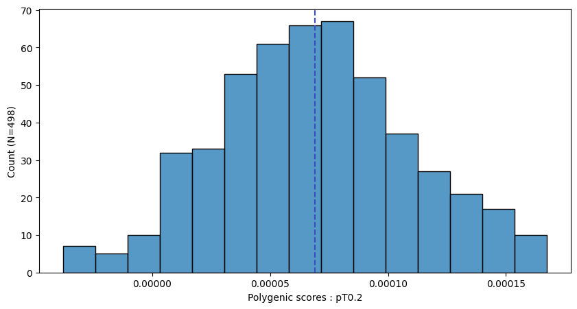

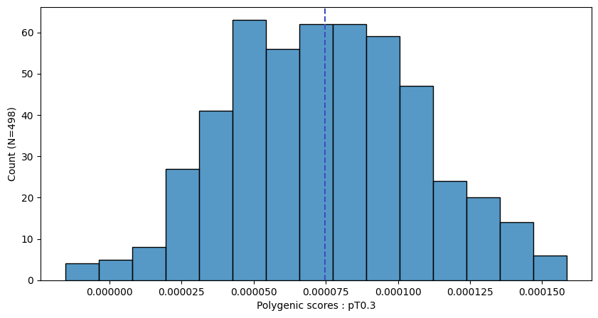

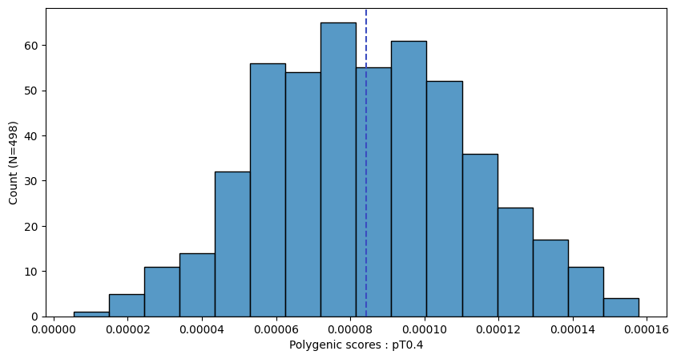

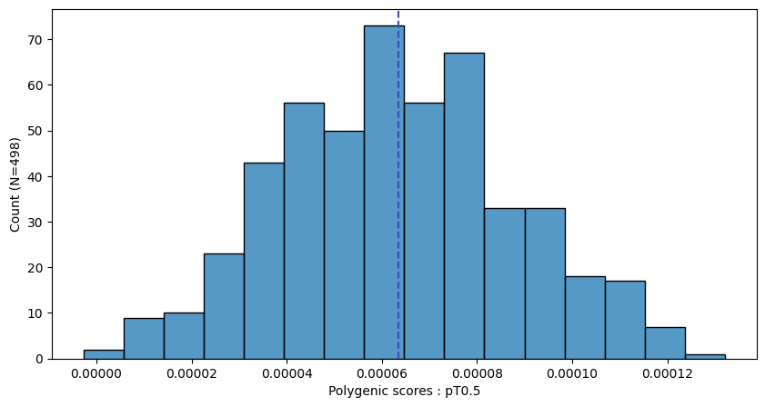

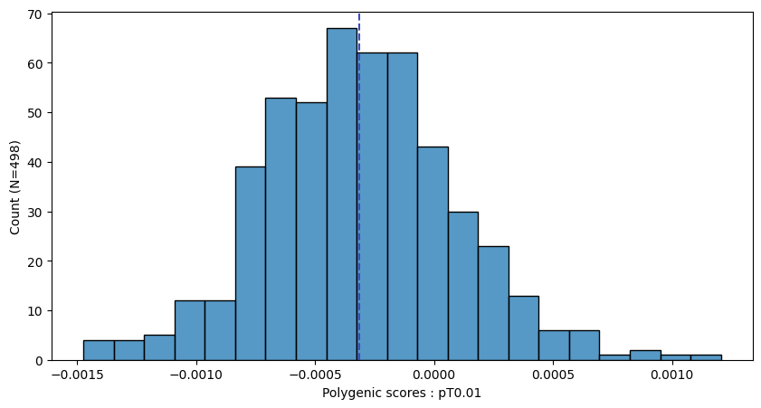


```python
a.plot_prs(scores=a.score_cols,phenos=["T2D"],fig_args={"figsize":(10,5)})

```

**stdout:**

```
Thu Jun 13 12:28:27 2024  -Plot args: {}
Thu Jun 13 12:28:27 2024  -Figure args: {'figsize': (10, 5)}
Thu Jun 13 12:28:27 2024  -Color map: coolwarm
Thu Jun 13 12:28:27 2024  -Color number: 2 (head: 0; tail: 0)
Thu Jun 13 12:28:27 2024  -Color map norm: [0.0, 1.0]
Thu Jun 13 12:28:27 2024  -Color to use: ['#3b4cc0', '#b40426']

```

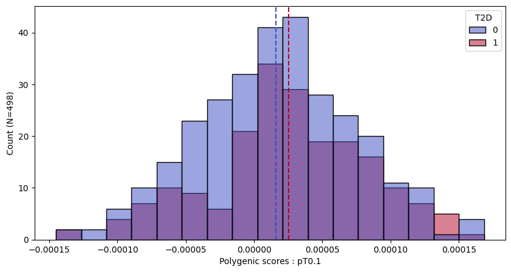

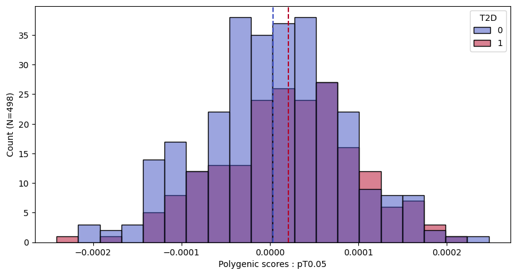

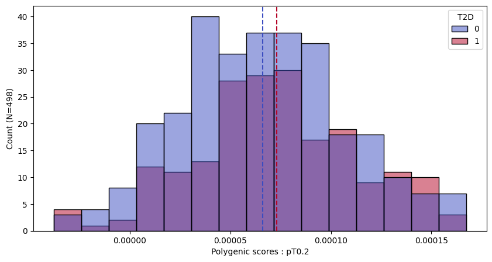

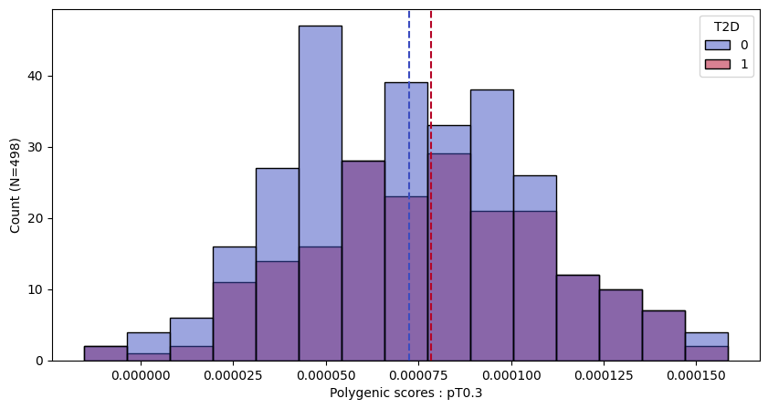

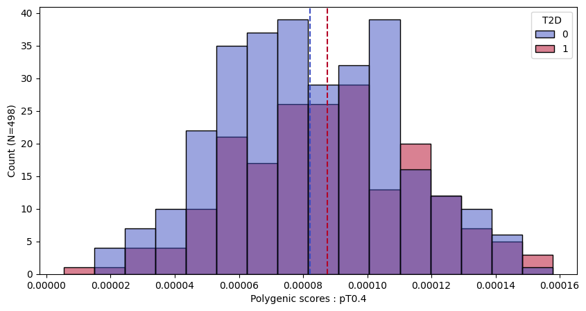

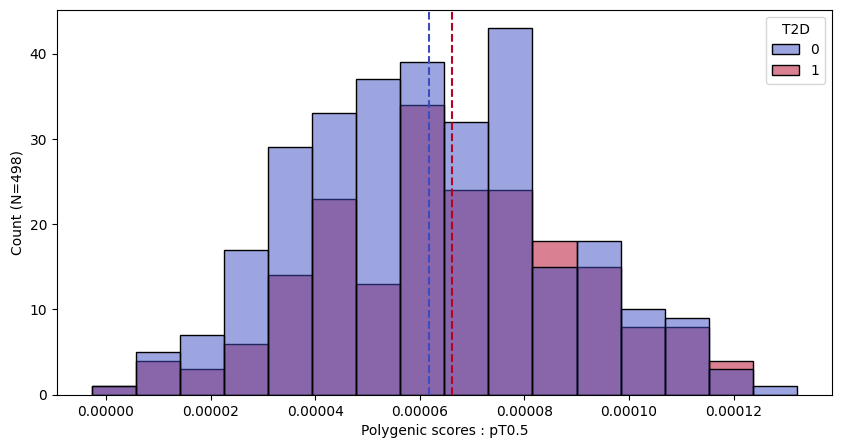

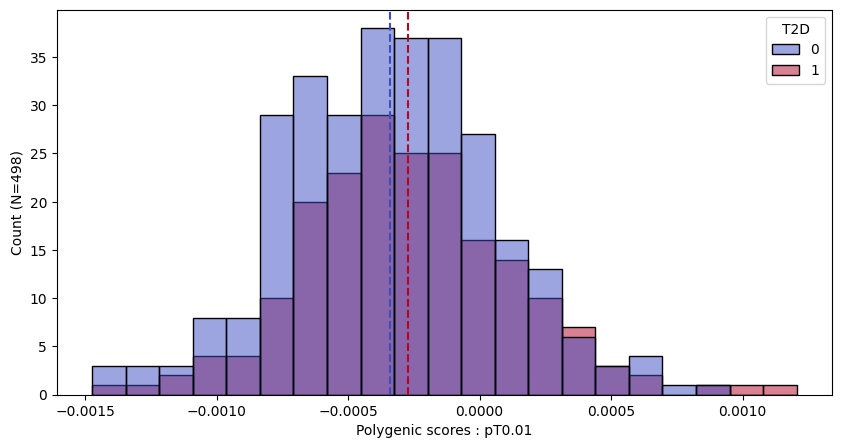
